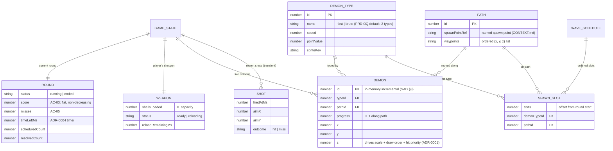

# Data model — basic-shooting-range

> **Adaptation note.** The stage-08 template targets a server-side Postgres schema. This
> feature is a client-only browser game with **no persisted storage** (PRD §6.1: all state
> is ephemeral; SAD §8: in-memory ids, no persistence). The model below is the in-memory
> storage contract: the single mutable `GameState` (ADR-0003) plus immutable static config.
> SQL migrations are N/A — see [Storage & migrations](#storage--migrations). Rules file:
> [`.claude/rules/migrations.md`](../../../.claude/rules/migrations.md).

## ER diagram

## Entities

Aggregate root: **`GameState`** (`src/core/state.ts`, ADR-0003) — owns all runtime entities below; systems are plain functions mutating it on the fixed step (ADR-0002). Static config (`DEMON_TYPE`, `PATH`, `WAVE_SCHEDULE`) is immutable data referenced by id.

### `GameState` (aggregate root)

| Field | Type | Constraints / invariants | Notes |
|---|---|---|---|
| `round` | `Round` | exactly one | current round only — no history (Non-goal N7) |
| `weapon` | `Weapon` | exactly one | single shotgun |
| `demons` | `Demon[]` | only live demons | resolved demons are removed (hard-delete analog); outcome recorded on `round` |
| `shots` | `Shot[]` | transient | kept for hit/miss feedback rendering, pruned after the cue |
| `fireIntents` | queued inputs | drained once per fixed step | fed by `input/pointer.ts` after AC-07 gating <!-- TBD: exact queue shape, lock during implementation --> |

### `Round`

| Field | Type | Constraints / invariants | Notes |
|---|---|---|---|
| `status` | `'running' \| 'ended'` | enum-in-code | freeze on `ended` (AC-04) |
| `score` | `number` | ≥ 0, non-decreasing, integer | AC-03: flat sum of `pointValue`, no multipliers |
| `misses` | `number` | ≥ 0 | AC-05: escaped demon = miss |
| `timeLeftMs` | `number` | ≥ 0, decremented by fixed step | ADR-0004 timer branch |
| `scheduledCount` | `number` | = length of wave schedule | set at round start |
| `resolvedCount` | `number` | ≤ `scheduledCount` | killed + escaped; end-condition compares counters, no scans |

### `Weapon`

| Field | Type | Constraints / invariants | Notes |
|---|---|---|---|
| `shellsLoaded` | `number` | `0..SHELL_CAPACITY` | consuming the last shell starts reload (Flow 5) |
| `status` | `'ready' \| 'reloading'` | enum-in-code | `try fire` while `reloading` is blocked, no shell consumed (AC-02) |
| `reloadRemainingMs` | `number` | ≥ 0, decremented by fixed step | never wall-clock (ADR-0002) |

### `Demon`

| Field | Type | Constraints / invariants | Notes |
|---|---|---|---|
| `id` | `number` | unique per round, incremental | SAD §8 ID strategy — no UUIDs client-side |
| `typeId` | `number` | must exist in `DEMON_TYPES` | resolved via keyed map, O(1) |
| `pathId` | `number` | must exist in `PATHS` | fixed path, never re-assigned (US-05) |
| `progress` | `number` | `0..1` | 1.0 un-killed → despawn + miss (AC-05) |
| `x`, `y`, `z` | `number` | derived from path at `progress` | cached for renderer + hit-test; `z` per ADR-0001 |

### `Shot` (transient)

| Field | Type | Constraints / invariants | Notes |
|---|---|---|---|
| `firedAtMs` | `number` | round-relative | input→shot latency NFR measurement point |
| `aimX`, `aimY` | `number` | DPR-corrected world coords | SAD §8 DPR mapping |
| `outcome` | `'hit' \| 'miss'` | enum-in-code | drives feedback cue only, then pruned |

### Static config (lookup-data analog — typed module constants)

| Entity | Fields | Notes |
|---|---|---|
| `DemonType` | `id`, `name`, `speed`, `pointValue`, `spriteKey` | 2 entries in MVP: fast/low-point, slow/high-point (PRD §8 default); values are data, scoring rule lives in `systems/score.ts` |
| `Path` | `id`, `spawnPointRef`, `waypoints: {x, y, z}[]` | fixed patterns (US-05); spawn point is the first waypoint |
| `WaveSchedule` | `SpawnSlot[]` = `{atMs, demonTypeId, pathId}` | sorted by `atMs` at build time; one round = one schedule in MVP <!-- TBD: concrete slot values — tuning during implementation (§11 accepted debt) --> |

## Access patterns (index-analog)

No indexes exist in-memory; each pattern below is the justification for a data-structure choice, same discipline as "one index per query".

| Pattern | Structure / strategy | Flow it serves | Justification |
|---|---|---|---|
| Hit-test: demons under crosshair → front-most by z | linear scan of `state.demons`, pick nearest by `z` | Flow 1 (AC-01, AC-06) | ≤ 30 live demons (SAD §7 budget) — O(n) per shot beats maintaining a sorted structure every step |
| Draw order far→near | sort by `z` per frame in renderer | Flow 6 (ADR-0001) | n ≤ 30, per-frame sort is cheap; keeps sim state flat and unordered |
| Due spawn slots | cursor index into time-sorted `SpawnSlot[]` | Flow 6 | schedule immutable + sorted at build time → amortized O(1) per step |
| Round end-condition | compare `resolvedCount` vs `scheduledCount` counters | Flow 4 (AC-04, AC-04b) | O(1) check inside the fixed step; no scan of demons + schedule |
| Reload readiness at try-fire | read `weapon.status` | Flow 2 / Flow 5 (AC-02) | O(1) field check |
| Config lookup by id | keyed `Record<id, DemonType/Path>` built at boot | all | FK-index analog: every `typeId`/`pathId` dereference is O(1) |

## Storage & migrations

**N/A in MVP — deliberate.** PRD §6.1: all state is ephemeral in the browser; nothing survives reload. Therefore: no database, no migration files, no seeds, no `updated_at`/`created_at` audit columns (time exists only as the fixed-step clock, ADR-0002).

- **Contract location:** the TypeScript types in `src/core/state.ts` are the schema; this document is its design rationale.
- **Hard-delete + audit analog:** resolved demons are removed from `state.demons`; the business-relevant residue (`score`, `misses`, `resolvedCount`) is recorded on `Round` — history is a separate concern, exactly per the course default.
- **Revisit triggers** (pre-committed in `.claude/rules/migrations.md`): persisted best score → versioned localStorage key with code migrations; server leaderboard (Non-goal N7) → real DB with the full course default set.

## Test fixtures

Factories in test code (never in config/state modules): `makeDemon(overrides?)`, `makeRound(overrides?)`, `makeGameState(overrides?)` returning valid defaults with per-test overrides. No global shared state between tests. PII guard trivially satisfied — the domain has no personal data.
