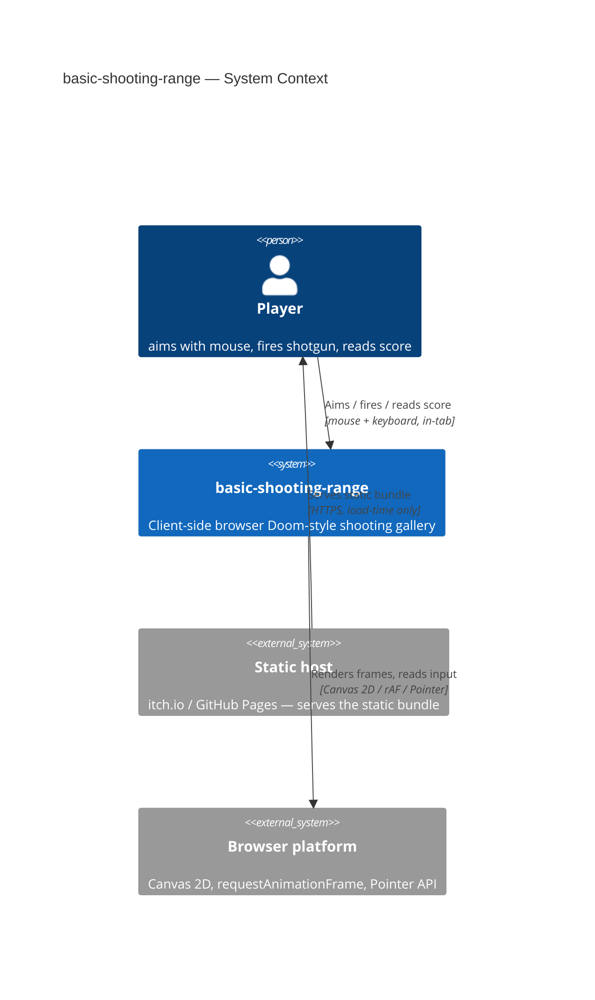
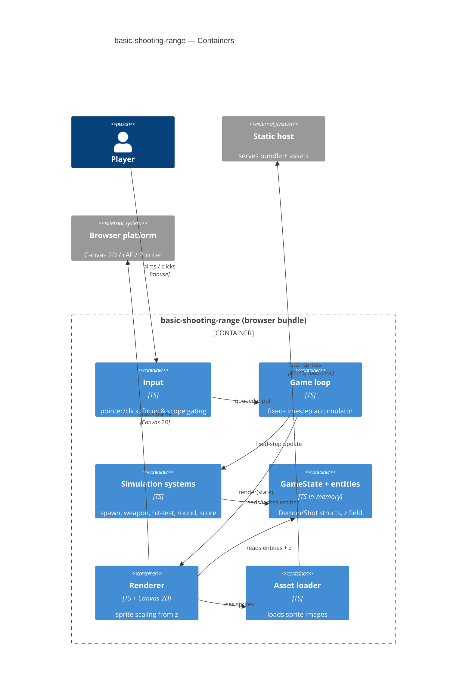

# Software Architecture Document — basic-shooting-range

<!-- Stages 04-05 → see sdlc/plugin/skills/architecture-design/SKILL.md -->
<!-- 12 Arc42 sections. Empty sections — <!-- N/A: <one-line reason> -->. -->
<!-- C4 Context (L1) lives inline in §3. C4 Container (L2) lives inline in §5. -->
<!-- Заповнений приклад: див examples/course-lesson-mvp/sad.md у sdlc/ toolkit. -->

## 1. Introduction and goals

<!-- 🎯 Навіщо: стабільна памʼять про «що + три головні якості + хто зацікавлений».     -->
<!--           Через рік ніхто не згадає на словах, ЯКІ ТРИ ЯКОСТІ для системи критичні. -->
<!-- 📋 Що писати: 1 абзац intent + 3 рядки топ-3 якості + таблиця stakeholders.        -->
<!-- 📌 Приклад: «QG-1: швидкість редагування блоку p95 ≤500 мс»                         -->

**Intent.** A client-side browser Doom-style shooting gallery: the player is stationary, aims with the mouse, and fires a reload-gated shotgun at demons that advance along fixed patterns; a round ends with a total score. It exists to be both a genuinely fun playable demo and an end-to-end SDLC artifact. The accepted vector is **Approach C — Layered 2.5D Shooting Gallery** (PRD §1): ship a flat-2D playable round first, then add a sprite-scaling depth layer additively (idea-brief §13).

**Top-3 quality goals (1-liners; full scenarios in §10):**

1. **QG-1 Performance** — sustained rendering under a wave: ≥ 30 FPS, frame-time p95 ≤ 33.3 ms (PRD §6).
2. **QG-2 Depth-readiness (additive extensibility)** — the demon carries a depth/`z` field from stage 1 so the 2.5D sprite-scaling layer is additive, not a rewrite (idea-brief §13 locked-in pointer).
3. **QG-3 Input fidelity** — click→hit ≤ 50 ms, crosshair→world error ≤ 2 px across DPR/resize, timing drift ≤ 1% between 60↔144 Hz (PRD §6).

**Stakeholders.**

| Role | Interest | Sign-off owner? |
|---|---|---|
| Player (author-as-player) | A fun mini-game — aim, shoot, score | No |
| Author-as-learner | An end-to-end SDLC artifact | No |
| Tech Lead (author) | SAD approval | Yes |

## 2. Constraints

<!-- 🎯 Навіщо: §4 (стратегія) працює тільки коли §2 зафіксувала, ЩО ВЖЕ ЗАФІКСОВАНО:    -->
<!--           стек, версії, дедлайн, регуляторні вимоги. Це вхід, не вихід.             -->
<!-- 📋 Що писати: чотири блоки — Технічні / Організаційні / Конвенції / Регуляторні.     -->
<!-- 📌 Приклад: «Postgres 18» (не «Postgres»); «дедлайн Q3 — жорсткий» (не «бажано»).    -->

**Technical.**
- TypeScript 5.x, target ES2022 — type safety for solo maintainability.
- Browser-only runtime, **no server / no backend** (PRD N2, §6.1); published as a static bundle (itch.io / GitHub Pages).
- Rendering surface: HTML5 Canvas 2D context. The pseudo-depth *technique* on top of it is a §4 strategic decision (see ADR-0001).
- Vite as bundler → static build output.

**Organisational.**
- 1 solo developer, a few evenings per week; **no hard deadline** (natural course window — PRD §1).
- Effort target: a clickable, scoreable round within ≤ 2 evenings (PRD §7 KPI).

**Conventions.**
- No CLAUDE.md yet — project conventions are pinned here and in [CONTEXT.md](./CONTEXT.md).
- 🔑 The demon entity carries a depth/`z` field from stage 1 (idea-brief §13 locked-in pointer) — it drives sprite scale, screen position, draw order, and hit priority.
- Code in English; domain vocabulary lives in CONTEXT.md `## Glossary`.

**Regulatory / external.**
- License-clean assets only for public release (PRD §6.1 abuse case).
- No PII / accounts / analytics in MVP → GDPR N/A (PRD §6.1). All state is ephemeral in the browser.

## 3. Context and scope

<!-- 🎯 Навіщо: малює КОРДОН СИСТЕМИ — хто з нею говорить ззовні, де закінчується зона довіри. -->
<!--           Без §3 §5 і §8 (авторизація) розпливаються — неясно, що «всередині», а що «зовні». -->
<!-- 📋 Що писати: 2-3 речення бізнес-контексту + таблиця зовнішніх систем + Mermaid C4Context. -->
<!-- 📌 Приклад: «зовнішні — нема (свідома відмова від third-party у v1)» — це теж рішення.   -->
<!-- Кордон довіри (trust boundary) — лінія, за якою ти не довіряєш даним без перевірки.       -->

<!-- brownfield: N/A — greenfield repo (only docs/ present at stage 04-05, no source files) -->

The game runs entirely in the player's browser. **Deliberate decision: there are no external services at runtime** — no backend, no API, no analytics. The only external actor is the static host, which serves the bundle once at load time; the browser platform provides the render and input APIs. The trust boundary is the browser tab, and all state is ephemeral (PRD N2, §6.1).

**External systems (in / out):**

| Actor or system | Type | Interaction |
|---|---|---|
| Player | Person | Aims / fires with the mouse, reads the score on the canvas |
| Static host (itch.io / GitHub Pages) | System (external) | Serves the static bundle over HTTPS (load-time only) |
| Browser platform (Canvas / rAF / Pointer API) | System (external) | Provides render + input APIs to the runtime |

**C4 Context (L1):**



## 4. Solution strategy

<!-- 🎯 Навіщо: 3-4 СТРАТЕГІЧНІ СТОВПИ, з яких потім ростуть усі ADR. Без §4 кожен ADR    -->
<!--           виглядає випадковим — нема зонтика. ⭐ Найгустіша секція — тут ADR-gate    -->
<!--           спрацьовує майже завжди (рішення незворотні + мульти-модульні).            -->
<!-- 📋 Що писати: список з 3-4 виборів. На кожен — заголовок + 2-3 речення rationale.    -->
<!-- 📌 Приклад: «Зберігати урок як таблицю блоків» — стовп, з якого виросло ADR-0001.    -->

**Four strategic pillars (the seeds for ADRs):**

1. **Render on Canvas 2D with per-frame sprite scaling** — the demon's screen scale, position, draw order (back→front) and hit priority (front-most) are all functions of its `z` field. This makes Approach C additive: the flat-2D round is the same code path with equal `z`, and the depth layer only starts varying `z`. Grows from §2 (Canvas 2D surface + the `depth/z` convention locked in from stage 1) and serves QG-2. → **ADR-0001**.
2. **Fixed-timestep game loop with a delta accumulator** — logic updates on a fixed step, rendering is decoupled from refresh rate. Directly satisfies §2/PRD §6 NFR *timing drift ≤ 1% between 60↔144 Hz* and QG-3 frame-rate independence — a variable-`dt` loop would let movement drift between refresh rates. → **ADR-0002**.
3. **Plain typed entities over an ECS** — `Demon` is a small typed struct (`z`, pos, pathId, hp, pointValue) inside a central `GameState`; no entity-component-system. Grows from the §2 organisational constraint (solo dev, playable round in ≤ 2 evenings): with only 2 demon types an ECS is over-engineering that spends the evening budget on framework, not gameplay. → **ADR-0003**.
4. **Round ends on all-resolved OR timer, no hard game-over** — the round ends when every wave demon is resolved (killed or escaped) or a fixed timer expires; an escape counts as a miss; there is no lose condition in MVP. Grows from §2 (no server → round state is ephemeral, the round is a self-contained client loop) and closes PRD §8 open question #1. → **ADR-0004**.

Each tactical decision in later sections should be traceable to one of these strategic seeds. Tactical decisions that *contradict* a strategic choice are red flags — surface them in §11 Risks.

## 5. Building block view

<!-- 🎯 Навіщо: ВНУТРІШНЯ ДЕКОМПОЗИЦІЯ — модулі, контейнери, БД. Статична топологія:   -->
<!--           хто з ким може говорити. Без §5 §6 (сценарії) не має словника учасників. -->
<!-- 📋 Що писати: 1 абзац про стиль (шари/гексагональна/clean/на подіях) +            -->
<!--           дерево папок + Mermaid C4Container.                                       -->
<!-- 📌 Приклад: «web-app, content-api, media-worker, postgres, s3, cdn».                -->

Feature-based modules inside one browser bundle. Simulation systems are plain functions over a central mutable `GameState` (ADR-0003); the game loop (ADR-0002) drives them on a fixed step and hands the state to the renderer (ADR-0001). It is a single-process monolith with one deploy unit.

**Internal decomposition:**

```
src/
├── main.ts              bootstrap: mount canvas, wire modules, start loop
├── core/
│   ├── loop.ts          fixed-timestep accumulator            (ADR-0002)
│   └── state.ts         GameState + entity types              (ADR-0003)
├── entities/
│   ├── demon.ts         Demon (z, pos, pathId, hp, pointValue)
│   └── shot.ts
├── systems/
│   ├── spawn.ts         spawn points + fixed paths            (US-05)
│   ├── weapon.ts        shotgun fire + reload gating          (US-01/02)
│   ├── hit.ts           resolve to front-most demon by z      (AC-06)
│   ├── round.ts         end-condition, timer, misses          (ADR-0004)
│   └── score.ts         score by demon type                   (US-03)
├── input/pointer.ts     aim + fire + focus/scope gating       (AC-07)
├── render/canvas2d.ts   sprite scaling from z                 (ADR-0001)
└── assets/sprites.ts    sprite image loading
```

**C4 Container (L2):**



## 6. Runtime view

<!-- 🎯 Навіщо: ПОТІК У RUNTIME для 1-2 критичних сценаріїв. Хто з ким коли і у якому     -->
<!--           порядку говорить. Без §6 §5 — лише купа коробок без життя.                  -->
<!-- 📋 Що писати: Mermaid sequenceDiagram. Учасники — імена з §5 (не вигадуй нові!).      -->
<!--           Повідомлення семантичні («складає чорновик»), БЕЗ HTTP-методів/шляхів —     -->
<!--           ендпоінт-рівневі sequence-діаграми зʼявляться у stage 06 (define-api).      -->
<!-- 📌 Приклад: «methodist → web-app: складає чорновик → web-app → content-api: зберегти». -->

**Critical flow 1: Fire → hit → score (US-01/03, AC-01, AC-06)**

```mermaid
sequenceDiagram
    actor Player
    participant Input
    participant Loop as Game loop
    participant Weapon
    participant Hit
    participant State as GameState
    participant Score
    participant Renderer
    Player->>Input: click (crosshair over demon)
    Input->>Loop: enqueue fire intent
    Loop->>Weapon: try fire (fixed step)
    Weapon->>State: loaded shell? → consume one
    Weapon->>Hit: resolve shot at crosshair
    Hit->>State: query demons under crosshair
    Hit-->>Weapon: front-most demon by z
    Weapon->>State: mark demon killed (remove)
    Weapon->>Score: add demon.pointValue
    Score->>State: round.score += value
    Loop->>Renderer: render(state)
    Renderer-->>Player: hit feedback + updated score
```

**Critical flow 2: Fire while reloading is blocked (US-02, AC-02)**

```mermaid
sequenceDiagram
    actor Player
    participant Input
    participant Loop as Game loop
    participant Weapon
    participant Renderer
    Player->>Input: click
    Input->>Loop: enqueue fire intent
    Loop->>Weapon: try fire
    alt mid-reload or no shell
        Weapon-->>Loop: blocked, no shell consumed
        Loop->>Renderer: render "weapon not ready" cue
        Renderer-->>Player: not-ready feedback
    end
```

**Critical flow 3: Demon escapes → miss (US-06, AC-05)**

```mermaid
sequenceDiagram
    participant Loop as Game loop
    participant Spawn
    participant State as GameState
    participant Round
    participant Renderer
    Loop->>Spawn: advance demons along paths (fixed step)
    Spawn->>State: update demon positions
    alt demon reached path end un-killed
        Spawn->>State: despawn demon
        Spawn->>Round: record miss
        Round->>State: round.misses += 1
    end
    Loop->>Renderer: render(state)
```

**Critical flow 4: Round end incl. concurrent final kill (US-04, AC-04, AC-04b)**

```mermaid
sequenceDiagram
    participant Loop as Game loop
    participant Weapon
    participant Score
    participant Round
    participant State as GameState
    participant Renderer
    actor Player
    Note over Loop: single fixed step
    opt final shot resolves this step
        Weapon->>Score: add final kill value
        Score->>State: round.score += value
    end
    Loop->>Round: check end-condition
    Round->>State: all resolved OR timer expired?
    Round->>State: freeze gameplay, finalize score
    Loop->>Renderer: render round result
    Renderer-->>Player: final total score
```

> AC-04b is guaranteed by ordering within a single fixed step: the final kill's score-add runs before the end-condition freeze (ADR-0002 fixed-timestep + ADR-0004 round-end).

## 7. Deployment view

<!-- 🎯 Навіщо: ТОПОЛОГІЯ, яку DevOps має знати без читання Helm-чартів — скільки реплік,  -->
<!--           де живе фоновий обробник, ПРИ ЯКИХ ЧИСЛАХ масштабуємось.                     -->
<!-- 📋 Що писати: 2-3 речення про топологію + метрики + алерти + конкретні числа-пороги.   -->
<!-- 📌 Приклад: «500 IC → партиціонування за кварталом» (не «при зростанні подумаємо»).    -->
<!-- 🎯 Можна N/A для XS/S функцій, що переюзають існуюче розгортання без змін.            -->

A single static bundle (Vite build) served from a CDN (GitHub Pages / itch.io). There is no server, no replicas, and no runtime scaling — everything runs on the player's device. The deployment unit is the set of static files; "release" is a push to the host.

**Monitoring:**
- No server telemetry in MVP — FPS is measured in-engine via a dev overlay (rAF frame-time), matching the PRD §6 measurement source.
- The host (itch.io / GitHub Pages) provides only coarse traffic counts; no per-session metrics are collected (PRD §6.1 — no analytics).

**Scaling thresholds:**
- Bundle + assets ≤ ~2–3 MB → keeps initial load ≤ 3 s on broadband (PRD §6 load NFR).
- ≤ ~30 concurrent live demons on screen → holds ≥ 30 FPS on mid-range hardware (PRD §6 FPS NFR). Revisit the sprite-scaling cost budget when the depth layer lands.

## 8. Crosscutting concepts

<!-- 🎯 Навіщо: НАСКРІЗНІ ПАТЕРНИ, які перетинають кілька модулів: логування, помилки,    -->
<!--           авторизація, ID strategy, outbox, кеш. ⭐ Друга найгустіша секція.          -->
<!--           Якщо патерн всередині одного модуля — він НЕ сюди. Якщо це конвенція        -->
<!--           проєкту в цілому — у CLAUDE.md.                                              -->
<!-- 📋 Що писати: таблиця концепт / конвенція / де визначено. Один рядок на концепт.      -->
<!-- 📌 Приклад: «UUID v7 (час+випадковий, сортується) у app-layer» — як default з CLAUDE.md. -->

| Concept | Convention | Where defined |
|---|---|---|
| Logging | `console` dev-logging only, no structured logs (client-side game) | here |
| Authentication | N/A — no accounts, no server | §3 |
| Error handling | Fail-soft: asset/render errors degrade to the flat demo rather than crash (PRD goal) | here |
| ID strategy | In-memory incremental entity ids, no persistence | here |
| Internationalisation | N/A — English only | — |
| Observability | In-engine FPS / frame-time dev overlay | §7 |
| Time / step | All systems consume the fixed step from the loop, never wall-clock directly | ADR-0002 |
| Depth / `z` | `z` drives sprite scale + screen position + draw order + hit priority everywhere | ADR-0001 |
| DPR / coordinate mapping | crosshair→world mapping accounts for devicePixelRatio + resize (aim error ≤ 2 px) | here |
| Assets / sprites | Source + sizing pipeline still open — see §11 open question | §11 |

## 9. Architecture decisions

<!-- 🎯 Навіщо: ЗВОРОТНИЙ ІНДЕКС на папку adr/. `ls adr/` дає файли, §9 дає семантику —    -->
<!--           чому вони існують, до якого зрізу SAD привʼязані, у якому статусі.           -->
<!-- 📋 Що писати: таблиця з 4 колонками. Один рядок на ADR. Mixed status — це OK.         -->
<!-- 📌 Приклад: «0001 | Зберігати урок як таблицю блоків | Accepted | §4».                -->

| # | Title | Status | Section |
|---|---|---|---|
| 0001 | Render on Canvas 2D with per-frame sprite scaling | Accepted | §4 |
| 0002 | Drive the game loop on a fixed timestep with a delta accumulator | Accepted | §4 |
| 0003 | Model entities as plain typed structs over an ECS | Accepted | §4 |
| 0004 | End a round on all-resolved OR timer, with no hard game-over | Accepted | §4 |

ADR files live under `docs/features/basic-shooting-range/adr/NNNN-<title>.md`.

## 10. Quality requirements

<!-- 🎯 Навіщо: ДЕРЕВО ЯКОСТЕЙ (Quality Tree) — беремо мету з §1 і розкладаємо на          -->
<!--           конкретні листя: тести, метрики, конфіги, drill-и. ⭐ Без §10 §1 — це       -->
<!--           маніфест. З §10 кожна декларація мапиться на щось, ЩО МОЖНА ДОВЕСТИ.        -->
<!-- 📋 Що писати: на кожну якість з §1 — When / Then / How verify. Числа з PRD §6 NFR     -->
<!--           ДОСЛІВНО (не округлюй p95 ≤250мс до ≤300мс — це F6-помилка критика).        -->
<!-- 📌 Приклад: «p95 ≤500 мс на UPDATE блоку, перевіримо k6 load test 100 req/s».        -->

Each top-3 goal from §1 expanded into a full scenario:

**QG-1. Performance**
- **When:** a wave of up to ~30 live demons is on screen.
- **Then:** ≥ 30 FPS, frame-time p95 ≤ 33.3 ms; input→hit ≤ 50 ms.
- **How verify:** rAF frame-time capture in a profiler during a scripted wave; in-engine timestamp delta for latency.

**QG-2. Depth-readiness (additive extensibility)**
- **When:** the 2.5D depth layer is added on top of the flat round.
- **Then:** the layer only varies `demon.z`; the hit-test / score / round contracts are unchanged (additive, not a rewrite).
- **How verify:** the flat round runs as a code path with all `z` equal; a diff shows the depth layer touches only the renderer + `z` population, not system contracts.

**QG-3. Input fidelity**
- **When:** playing across 60↔144 Hz and across DPR / window resize.
- **Then:** timing drift ≤ 1% between 60↔144 Hz; crosshair→world error ≤ 2 px; input→hit ≤ 50 ms.
- **How verify:** elapsed-time test on two refresh rates; crosshair→world mapping test on HiDPI + after resize.

## 11. Risks and technical debt

<!-- 🎯 Навіщо: ⭐ збирає ВСЕ, що може зламатись — і не лише технічне. Без §11 ризики   -->
<!--           обговорюються на стендапах і губляться; борг лишається у голові того,    -->
<!--           хто його прийняв.                                                          -->
<!-- 📋 Що писати: таблиця ризик/борг — серйозність — мітигація — власник. Технічний    -->
<!--           борг окремою секцією.                                                      -->
<!-- 📌 Приклад: «EM не пушить — member не оновлює дані | High | …». Перший ризик —      -->
<!--           часто продуктовий, не технічний. Це нормально.                            -->

<!-- Severity column literals: Low / Medium / High for regular risks; "Open question" for rows
     created by Step-7 `Save as Open Question` resolutions (see references/socratic-loop.md). -->

| Risk / debt | Severity | Mitigation | Owner |
|---|---|---|---|
| MVP round has no fail state → may feel low-tension until the depth layer lands | Medium | escape=miss gives soft stakes; revisit the lose-condition with the depth layer | Maksim (product) |
| Canvas 2D FPS ceiling above ~30 concurrent demons | Medium | cap spawns, profile; move to WebGL only if truly needed (ADR-0001) | Maksim |
| The "additive" depth layer silently becomes a rewrite if `z` is not wired from stage 1 | Medium | `z` is a §2 locked-in convention + QG-2 additive-diff test | Maksim |
| Asset-licensing takedown once published | Low | license-clean assets only (PRD §6.1) | Maksim |
| Open architectural decision: asset / sprite source + sizing pipeline | Open question | Resolve before implementation; depends on art capability (Save-as-OQ from §8) | Maksim |
| Open architectural decision: hard lose-condition ("a demon reaches the player") | Open question | Resolve at the depth-layer stage (deferred in ADR-0004) | Maksim |

**Accepted debt (acceptable in v1, plan to fix later):**
- No render interpolation in loop v1 (ADR-0002 neutral) — add if visible judder appears.
- In-memory incremental ids, no persistence — OK (no save / leaderboard, PRD N7).
- Exact demon-type count and point values not fixed (PRD default: 2 types) — tune during implementation.

## 12. Glossary

<!-- 🎯 Навіщо: ⭐ СЛОВНИК ДОМЕНУ, який припиняє суперечки через рік («checkpoint —      -->
<!--           weekly чи biweekly? Quarter — календарний чи фіскальний?»).                -->
<!-- 📋 Що писати: таблиця термін / значення. Бізнес-терміни + технічні вперемішку.       -->
<!--           Один термін може мати дві мови у заголовку: «Goal (Обʼєктив)».              -->
<!-- 📌 Приклад: «Lesson | урок усередині курсу, що складається з блоків (text, video)». -->

| Term | Meaning |
|---|---|
| Demon | A target creature the player shoots at (CONTEXT). Carries a `z` depth field from stage 1. |
| Wave | The group of demons appearing within a single round/run (CONTEXT). |
| Spawn point | A fixed screen coordinate where a demon appears — a single coordinate, not an area (CONTEXT). |
| Reload | The delayed shotgun-refill process that blocks firing while it lasts (CONTEXT). |
| Score | The flat total of points accumulated in one round, no multiplier (CONTEXT, PRD N4). |
| Miss | A demon that reaches the end of its path un-killed; recorded against the round (AC-05). |
| Round | One self-contained play session; ends on all-resolved OR timer, no game-over (ADR-0004). |
| Depth / `z` | Per-demon field driving sprite scale, screen position, draw order, and hit priority (ADR-0001). |
| Sprite scaling | The pseudo-depth technique: on-screen size = f(`z`) on the Canvas 2D surface (ADR-0001). |
| Fixed timestep | Logic advances in fixed increments via a delta accumulator, decoupled from refresh rate (ADR-0002). |
| Front-most hit | On overlapping demons, the shot resolves to the nearest by `z` (AC-06). |
