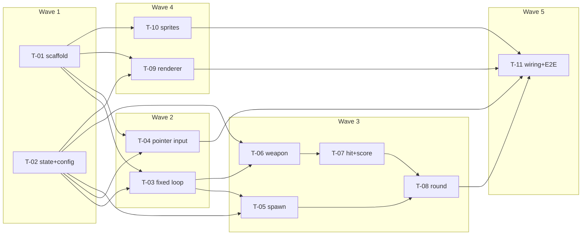

# Task breakdown — basic-shooting-range

<!-- Stage 13 → see SDLC/plugin/skills/break-tasks/SKILL.md -->

## What is being built (for the 1-minute reader)

A client-side browser Doom-style shooting gallery ([[../PRD.md]]): stationary player, mouse aim, reload-gated shotgun, demons on fixed paths with a depth/`z` field from day one, round ends with a flat score. Architecture: TS + Vite + Canvas 2D monolith, fixed-timestep loop, plain typed entities ([[../sad.md]] §4-§5, ADR-0001…0004). No backend, no persistence — the data contract is [[../data-model.md]] (in-memory `GameState`).

**Slicing:** 11 stories in 5 waves; each ≤ 1 day, one story = one reviewable PR (≤ 500 LOC). Stories link to PRD AC / SAD §6 flows / data-model sections — they do not duplicate them.

## Dependency graph

Parallel branches: T-01 ∥ T-02; T-03 ∥ T-04; T-05 ∥ T-06 (then T-06→T-07→T-08); T-09 ∥ T-10 (renderer starts on placeholder shapes, sprites land independently).

## Tasks

| ID | Title | DoR | DoD (summary — full DoD in story) | Deps | Estimate | Owner |
|----|-------|-----|------|------|----------|-------|
| T-01 | Project scaffold (Vite+TS+canvas) | SAD Accepted | dev+build green, blank DPR-aware canvas | — | S | Maksim |
| T-02 | GameState, entities & static config | data-model Accepted | types match data-model 1:1, factories + tests | — | M | Maksim |
| T-03 | Fixed-timestep loop | T-01, T-02 | drift ≤1% test + spiral guard green | T-01, T-02 | M | Maksim |
| T-04 | Pointer input: mapping + AC-07 gating | T-01, T-02 | ≤2 px mapping + gating tests green | T-01, T-02 | S | Maksim |
| T-05 | Spawn: schedule, paths, escape=miss | T-02, T-03 | AC-05 unit tests green | T-02, T-03 | M | Maksim |
| T-06 | Weapon: fire, shells, reload | T-02, T-03 | AC-02 + Flow-5 unit tests green | T-02, T-03 | M | Maksim |
| T-07 | Hit-test by z + score | T-06 | AC-01/03/06 tests incl. non-decreasing property | T-06 | M | Maksim |
| T-08 | Round: end-condition + freeze | T-05, T-07 | AC-04/04b tests incl. same-step kill | T-05, T-07 | S | Maksim |
| T-09 | Renderer: scaling from z + HUD | T-01, T-02 | z-order test + 30-demon FPS check | T-01, T-02 | M | Maksim |
| T-10 | Sprites & assets (closes §11 OQ) | sprite-source OQ resolved | license note + fail-soft + budget | T-01 | S | Maksim |
| T-11 | Wiring, playable round, NFR E2E | all waves 1-4 done | all AC walkthrough + 5 NFR numbers recorded | T-04, T-08, T-09, T-10 | M | Maksim |

Total: ~9–10 solo evenings-equivalent; critical path T-02 → T-03 → T-06 → T-07 → T-08 → T-11.

## Risks (delta to [[../sad.md]] §11)

- T-10 has a product DoR (sprite-source open question, SAD §11) — if it slips, T-11 still ships on placeholder shapes (fail-soft), only the visual polish moves.
- T-11 is the only story that can reveal cross-system ordering bugs (AC-04b); its step-order contract is pinned in T-08 to keep the blast radius small.

## Estimation legend

- XS: ≤2h · S: ≤1d · M: 1-2d (borderline — split if it grows) · L: must be split.

## Links

- [[../PRD.md]] · [[../sad.md]] · [[../data-model.md]] · [[../CONTEXT.md]] · ADRs: [[../adr/0001-render-on-canvas-2d-with-sprite-scaling.md]], [[../adr/0002-fixed-timestep-game-loop.md]], [[../adr/0003-plain-typed-entities-over-ecs.md]], [[../adr/0004-round-ends-on-all-resolved-or-timer.md]]
- Runner state: [tracker.md](./tracker.md)
