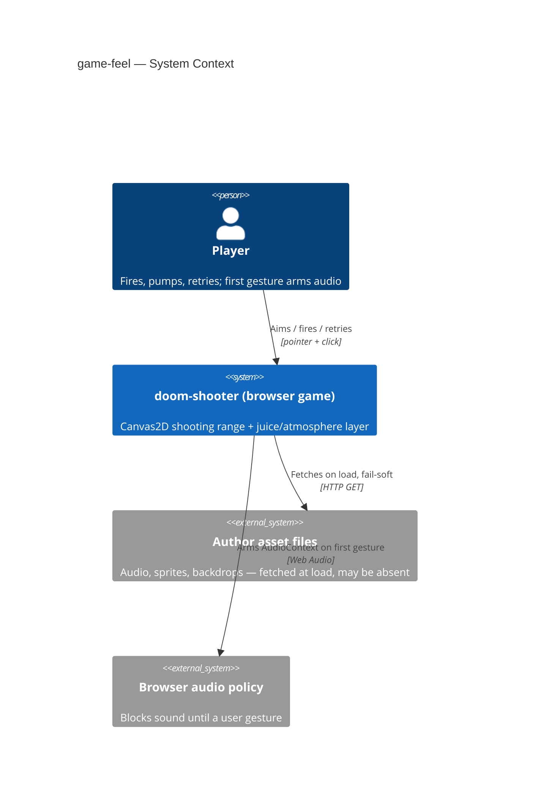
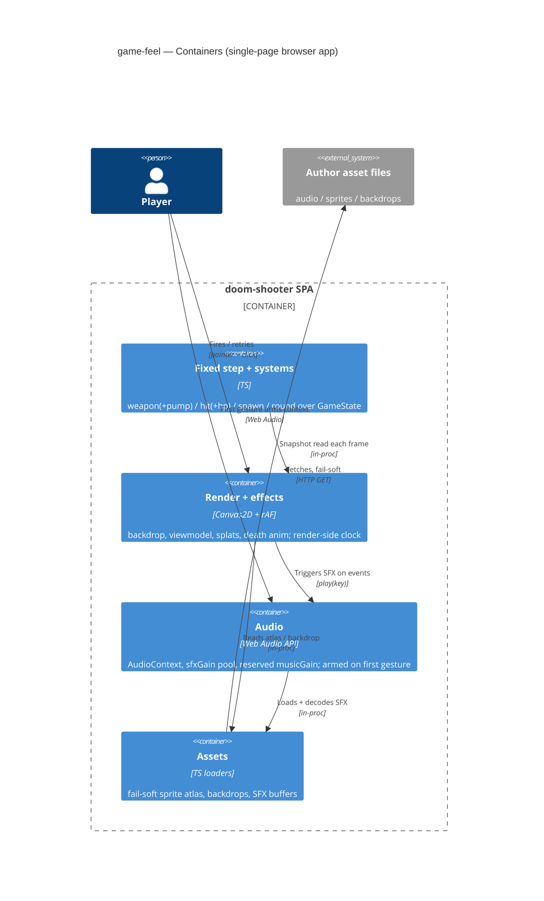

# Software Architecture Document — game-feel

<!-- Stages 04-05 → see sdlc/plugin/skills/architecture-design/SKILL.md -->
<!-- Extends the shipped basic-shooting-range engine; only the deltas of this feature are described here. -->
<!-- C4 Context (L1) inline in §3. C4 Container (L2) inline in §5. -->

## 1. Introduction and goals

**Intent.** `game-feel` adds a juice/atmosphere layer on top of the mechanically-complete `basic-shooting-range` engine so the game reads as Doom instead of a silent tech demo. It wires author-supplied audio + sprites + a random backdrop, gives the shotgun a first-person viewmodel driven by weapon state, and extends the demon model with shot-durability (HP 1/2/4). Every effect is additive and fail-soft; the deterministic fixed step and the non-decreasing-score invariant carry over untouched. Primary user: the author (as player and demo publisher); secondary: casual viewers of the published itch.io / GitHub Pages build (PRD §1).

**Top-3 quality goals (1-liners; full scenarios in §10):**

1. **Responsiveness** — every player action (shoot / pump / spawn / hurt / death / retry) yields visible **and** audible feedback within ≤ 100 ms (PRD §6). *(Reload dropped 2026-07-11 — unlimited ammo, pump is the only weapon gate; see PRD §1 amendment.)*
2. **Determinism preserved under juice** — ≥ 30 FPS with viewmodel + concurrent death animations + backdrop, while the fixed step gains **zero** new mutations (drift ≤ 1%, aim ≤ 2 px unchanged) (PRD §6).
3. **Fail-soft assets** — any missing/broken author asset degrades to placeholder/silence and never crashes a round (PRD AC-06).

**Stakeholders.**

| Role | Interest | Sign-off owner? |
|---|---|---|
| player (author) | Plays the round; the "feel like Doom" payoff | No |
| author-as-publisher | Ships a license-clean demo to itch.io / GitHub Pages | No |
| Tech Lead | SAD approval, invariant/determinism preservation | Yes |

## 2. Constraints

**Technical.**
- TypeScript (strict, ES2022) + Vite 6 + Canvas 2D — inherited from `basic-shooting-range` SAD §2; this feature adds no new build stack.
- **Web Audio API** (single `AudioContext`) is the one new platform API introduced — see [[adr/0003-web-audio-graph-armed-on-first-gesture]].
- The engine runs a **deterministic fixed step decoupled from render** (base ADR-0002). All pure juice is computed on the render layer and must add **zero** mutations to the fixed step or the crosshair→world aim mapping.
- Existing **fail-soft sprite loader** (`src/assets/sprites.ts`, `atlas.get → null → placeholder`) is the mandated pattern every new asset kind reuses.
- No persistence — all state ephemeral, a reload resets everything (PRD §N4, `.claude/rules/migrations.md`).

**Organisational.**
- Effort budget ≈ 1 week, size **S** (`docs/features/game-feel/.size`).
- Team: solo (author). No external reviewers beyond the Tech Lead sign-off role.

**Conventions.**
- Global user + project conventions in `CLAUDE.md`; base engine conventions in `docs/features/basic-shooting-range/sad.md`.
- Systems are plain functions over one central mutable `GameState` (base ADR-0003); IDs are in-memory incremental integers.
- 2+ args ⇒ destructured options object; arrow functions preferred (memory: code-style).

**Regulatory / external.**
- Asset licensing: only license-clean author-supplied audio/sprites/backdrops may be published (PRD §6.1 abuse cases). No PII, no network surface.

## 3. Context and scope

<!-- brownfield: extends basic-shooting-range in the same repo; Explore scan folded into §1 traceability + verified against src/ 2026-07-05. -->

The system stays a single client-side browser game with no backend. `game-feel` adds two external touchpoints that were dormant before: **author-supplied asset files** (audio, sprites, backdrops) fetched at load, and the **browser audio autoplay policy**, which requires a user gesture before sound can play. Both sit outside the trust boundary as inputs that may be absent or blocked — the fail-soft contract (§8) is exactly the response to that.

**External systems (in / out):**

| Actor or system | Type | Interaction |
|---|---|---|
| player | Person | Fires, pumps, clicks "try again"; supplies the first gesture that arms audio |
| author asset files | System (static, external) | Audio/sprite/backdrop files fetched at load; any may be missing → fail-soft |
| browser audio policy | System (external) | Gates `AudioContext` until the first user gesture (AC-07) |

**C4 Context (L1):**



## 4. Solution strategy

**Top-4 strategic choices (the seeds for ADRs):**

1. **HP as a bounded field on the demon, damaged inline in the hit path** — the smallest change that adds durability without a new system or a second source of truth; preserves front-most-by-`z` resolution and the non-decreasing-score invariant. → [[adr/0001-demon-hp-as-bounded-field-damaged-inline]].
2. **Pump gates fire rate as a fixed-step weapon state** — the pump is the *only* juice element that changes gameplay, so its timer lives on the fixed step; its sprite alone is render-side. *(Reload removed 2026-07-11 — pump is now the sole fixed-step weapon gate.)* → [[adr/0002-pump-as-fixed-step-weapon-gate]].
3. **A Web Audio graph armed once on the first gesture, with an SFX bus now and a music bus reserved** — one `AudioContext`, `masterGain → sfxGain` (decoded buffers, capped voice pool) with a `musicGain` seam for a future streamed track, so adding music later needs no rework. → [[adr/0003-web-audio-graph-armed-on-first-gesture]].
4. **All juice animation state lives on the render layer, off `GameState`** — death animations, viewmodel frames and hit splats are driven by a render-side rAF clock; the killing shot despawns the demon on the fixed step, render holds the transient dying visual. This is what keeps base ADR-0002 (determinism) and the drift/aim tests intact. → [[adr/0004-juice-animation-state-on-render-layer]].

Each tactical decision below traces to one of these four seeds. Any tactical choice that would mutate the fixed step for a purely-visual effect is a red flag surfaced in §11.

## 5. Building block view

The engine keeps its feature-based module layout: plain systems mutate one central `GameState` on the fixed step; `render/` reads a snapshot each frame. `game-feel` **extends existing modules** (demon entity gains `hp`; weapon gains a `pumping` state; renderer gains viewmodel/splat/death-anim/backdrop passes) and **adds two render-side modules**: `src/audio/` (Web Audio graph + SFX pool) and a render-side animation/effects store. No new module touches the fixed step except the two gameplay deltas (HP damage in `systems/hit.ts`, pump timer in `systems/weapon.ts`).

**Internal decomposition (● new, ◐ extended, ○ unchanged):**

```
src/
├── core/
│   ├── config.ts        ◐ + PUMP_DURATION_MS(350), demon maxHp per type, 4-HP type, SHOT_SPLAT_MS
│   ├── state.ts         ◐ Weapon.status gains 'pumping' + pumpRemainingMs; Demon gains hp
│   ├── step.ts          ○ order unchanged (weapon → spawn → round)
│   └── loop.ts          ○ fixed step unchanged
├── entities/
│   └── demon.ts         ◐ + hp field (maxHp resolved from DemonType)
├── systems/
│   ├── weapon.ts        ◐ pump gate: 'pumping' blocks fire; timer on fixed step. Reload/shells REMOVED (2026-07-11): drop SHELL_CAPACITY, reload status, unlimited ammo
│   ├── hit.ts           ◐ hp-- inline; despawn + applyKill only on hp==0
│   ├── score.ts         ○ applyKill unchanged (still called once, on the killing shot)
│   ├── spawn.ts         ○ unchanged (HP set at spawn from type)
│   └── round.ts         ○ end-condition unchanged (AC-09 handled render-side)
├── audio/               ● NEW — Web Audio graph, SFX buffer pool, arm-on-gesture, fail-soft
│   ├── audio.ts         ●   AudioContext, masterGain→sfxGain(+ reserved musicGain), voice cap
│   └── sfx.ts           ●   load+decode SFX buffers, play(key), missing→silent
├── render/
│   ├── canvas2d.ts      ◐ + backdrop pass, viewmodel pass, splat pass, death-anim pass
│   └── effects.ts       ● NEW — render-side effect store: death visuals, splats, viewmodel clock (rAF delta)
├── assets/
│   ├── sprites.ts       ◐ + viewmodel frames, per-HP-step hurt frames, death frames (reuses atlas)
│   ├── backdrops.ts     ● NEW — random backdrop pick per round, fail-soft (→ black)
│   └── demon-art.ts     ◐ + hurt/death art per demon type
└── main.ts              ◐ arm audio on first gesture; wire effects store; retry button → createInitialGameState + reroll backdrop; prune splats
```

**C4 Container (L2):**



## 6. Runtime view

**Critical flow 1: fire → pump-gate → SFX + splat + viewmodel (AC-01, AC-02, AC-07)**

```mermaid
sequenceDiagram
    actor Player
    participant Input as input/pointer
    participant Weapon as systems/weapon (fixed step)
    participant Hit as systems/hit
    participant FX as render/effects
    participant Audio as audio
    Player->>Input: click (aim)
    Note over Player,Audio: first-ever gesture also arms AudioContext (AC-07)
    Input->>Weapon: enqueue FireIntent
    alt weapon ready
        Weapon->>Weapon: status → 'pumping', pumpRemainingMs = PUMP_DURATION_MS (no ammo/shells)
        Weapon->>Hit: resolveFire (front-most by z)
        Hit-->>FX: hit splat at impact (render-side)
        Weapon-->>Audio: play('shoot')  %% shoot sound includes the pump/cock; no separate pump sound
    else pumping
        Weapon-->>Player: fire blocked, dropped (AC-02)
    end
    FX->>FX: run viewmodel firing→pump→idle on rAF clock
```

**Critical flow 2: killing shot → fixed-step despawn + render-side death animation, with round-end race (AC-04, AC-09)**

```mermaid
sequenceDiagram
    participant Hit as systems/hit (fixed step)
    participant Score as systems/score
    participant Round as systems/round
    participant FX as render/effects
    participant Audio as audio
    Hit->>Hit: hp-- ; hp == 0
    Hit->>Score: applyKill (score += pointValue, once)
    Hit->>Hit: remove demon from GameState.demons
    Hit-->>FX: spawn death visual (typeId, ~1s clock)
    Hit-->>Audio: play('death')
    Round->>Round: end-condition may freeze THIS step (score already committed, AC-04b)
    Note over FX,Round: death visual lives on render layer — a frozen round keeps playing/holding it, never mutates finalized score (AC-09)
```

**Critical flow 3: try again (AC-10)** — the "try again" click calls `createInitialGameState()` (fresh score/round/weapon), rerolls a random backdrop via `assets/backdrops`, and clears the render-side effects store; no demon, score, or weapon state leaks from the prior round.

## 7. Deployment view

<!-- N/A: feature reuses the base game's static build. `vite build` → `dist/` → GitHub Pages / itch.io, unchanged. -->

No deployment change. `game-feel` ships in the same static `dist/` bundle as `basic-shooting-range` (Vite build → GitHub Pages / itch.io). New asset files are served as static files alongside the bundle; no server, no runtime infra. Bundle size grows with wiring code only (assets are separate fetched files). The base game's ≤ 3 s playable-load NFR is preserved by fail-soft loading (assets never block the round).

## 8. Crosscutting concepts

| Concept | Convention | Where defined |
|---|---|---|
| Fail-soft assets | `atlas.get`/loader returns `null`/no-op on a missing file; renderer/audio fall back to placeholder/silence, never throw (AC-06) | `src/assets/sprites.ts` pattern, extended to `audio` + `backdrops` |
| Render/fixed-step boundary | Pure juice reads a `GameState` snapshot and never mutates it; only HP damage (hit.ts) and the pump timer (weapon.ts) touch the fixed step | base ADR-0002 + [[adr/0004-juice-animation-state-on-render-layer]] |
| Animation clock | Render-side effects advance on the rAF frame delta, not the fixed step and not wall-clock timers spread across modules | `src/render/effects.ts` |
| Audio arming | One `AudioContext` resumed on the first user gesture; before that, `play()` is a silent no-op (AC-07) | [[adr/0003-web-audio-graph-armed-on-first-gesture]] |
| Voice-pool cap | Concurrent SFX voices capped by a constant so overlapping deaths + rapid fire never distort (PRD §6) | `src/audio/audio.ts` |
| Logging | Fail-soft fallbacks log once (matches base `assets.sprite_unavailable` convention), never spam per frame | `src/assets/*` |
| ID strategy | Unchanged — in-memory incremental integers per entity kind (base SAD §8) | base SAD |

## 9. Architecture decisions

| # | Title | Status | Section |
|---|---|---|---|
| 0001 | Model demon HP as a bounded field, damaged inline in the hit path | Accepted | §4, §5 |
| 0002 | Gate fire rate with a fixed-step pump state on the weapon | Accepted | §4, §6 |
| 0003 | Run a Web Audio graph armed on the first gesture, SFX bus + reserved music bus | Accepted | §4, §8 |
| 0004 | Keep juice animation state on the render layer, off GameState | Accepted | §4, §8 |

ADR files live under `docs/features/game-feel/adr/NNNN-<title>.md`.

## 10. Quality requirements

**QG-1. Responsiveness (action→feedback ≤ 100 ms)**
- **When:** the player fires / pumps, or a demon spawns / is hurt / dies / the player retries.
- **Then:** the paired visible frame + audible SFX begin within ≤ 100 ms of the action (in-engine timestamp delta: event → sound trigger + firing frame).
- **How verify:** in-engine timestamp assertion (fire event → `play()` + viewmodel frame); manual walkthrough of all 6 action→feedback pairs (KPI: 6/6).

**QG-2. Determinism preserved under juice (≥ 30 FPS, 0 fixed-step mutations added by pure juice)**
- **When:** a wave runs with the viewmodel + multiple concurrent death animations + a backdrop active.
- **Then:** frame-time p95 ≤ 33.3 ms (≥ 30 FPS); timing drift ≤ 1% between 60↔144 Hz; crosshair→world error ≤ 2 px across DPR/resize — all **unchanged** from base because pure juice adds no fixed-step mutation.
- **How verify:** existing `createFrameTimer` profile under a stress wave; base drift test (two refresh rates) and aim-mapping test (HiDPI + resize) re-run **green with juice enabled** (no juice code path mutates GameState except HP + pump).

**QG-3. Fail-soft assets + audio overlap safety**
- **When:** an author asset (sound / sprite / backdrop) is missing or fails to load, or overlapping deaths + rapid fire play many SFX at once.
- **Then:** the action still resolves — placeholder/silence — and never crashes the round (AC-06); concurrent voices stay capped so audio never distorts.
- **How verify:** fail-soft unit tests per asset kind (missing key → no-op/placeholder); voice-pool cap constant audited under a stress wave; playable-load ≤ 3 s with assets still loading.

## 11. Risks and technical debt

| Risk / debt | Severity | Mitigation | Owner |
|---|---|---|---|
| Browser audio autoplay policy blocks the first shot's sound (top devil's-advocate risk) | High | Arm `AudioContext` on the first user gesture; before arming `play()` is a silent no-op, so the shot never errors — only the very first pre-gesture sound is silent (AC-07) | Maksym |
| Per-HP-step hurt frames (OQ3 resolved to per-step) multiply required art: a 4-HP demon needs full + hurt@3/@2/@1 + death frames | Medium | Fail-soft covers missing frames (→ nearest/placeholder); author draws incrementally, tuning debt not a blocker | Maksym |
| Death-animation despawn timing vs round-end freeze could double-count or lose score | Medium | Killing shot despawns + scores on the fixed step (once, AC-04b); render holds the dying visual — a frozen round never mutates the finalized score (AC-09, [[adr/0004-juice-animation-state-on-render-layer]]) | Maksym |
| Open question: exact asset list (SFX count, backdrop count, viewmodel + per-HP-step demon sprite sheets) | Open question | Resolve before implementation; default: 1 SFX per action, ≥ 2 backdrops, 1 shotgun sheet, per-type demon set incl. per-HP-step hurt + death frames | Maksym |
| Open question: HP-tier balance — point values + spawn mix for 1/2/4-HP demons | Open question | Resolve during implementation (tuning debt); default: fast=1 HP, brute=2 HP, add one 4-HP type | Maksym |

**Accepted debt (acceptable in v1, plan to fix later):**
- Background music not implemented — only the `musicGain` seam is reserved in the audio graph ([[adr/0003-web-audio-graph-armed-on-first-gesture]]); a future track streams via `HTMLMediaElement` into that bus without reworking SFX.
- Config numeric values (PUMP_DURATION_MS = 350, HP tiers, point values) are placeholder tuning constants, adjusted during implementation.

## 12. Glossary

Feature terms are canonical in `docs/features/game-feel/CONTEXT.md` (juice, viewmodel, pump/rack, hit points/HP, hurt state, death animation, backdrop, retry); shared gameplay terms in `docs/features/basic-shooting-range/CONTEXT.md`. Key architectural terms used above:

| Term | Meaning |
|---|---|
| Fixed step | Deterministic simulation tick decoupled from render (base ADR-0002); only HP damage + pump timer are added to it here |
| Render layer | rAF-driven draw pass that reads a GameState snapshot; owns all pure-juice animation state |
| Voice pool | Capped set of concurrent Web Audio SFX voices, so overlapping sounds never distort |
| SFX bus / music bus | `sfxGain` / reserved `musicGain` nodes under `masterGain` in the audio graph |
| Hurt state | Alive-and-damaged demon (`hp < maxHp`); shows a per-HP-step hurt frame, can still escape as a miss |
