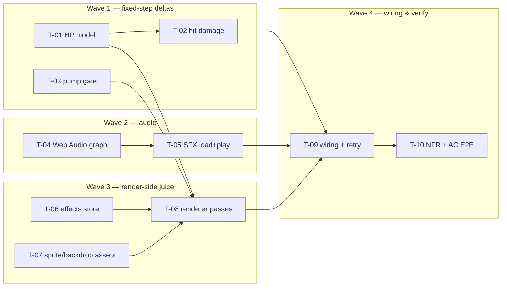

# Task breakdown — game-feel

<!-- Stage 13 → see SDLC/plugin/skills/break-tasks/SKILL.md -->

## What is being built (for the 1-minute reader)

A juice/atmosphere layer on top of the shipped `basic-shooting-range` engine so the game reads as Doom instead of a silent tech demo ([[../PRD.md]]): audible + visible feedback for every action, a shotgun viewmodel driven by weapon state, demon shot-durability (HP 1/2/4) with hurt/death visuals, a random backdrop per round, and one-click "try again". Every asset is fail-soft; the deterministic fixed step and the non-decreasing-score invariant carry over untouched ([[../sad.md]] §4–§5, ADR-0001…0004).

**The one architectural spine:** only **two** deltas touch the fixed step — HP damage in `hit.ts` (ADR-0001) and the pump timer in `weapon.ts` (ADR-0002). Everything else (audio, effects store, renderer passes, assets, wiring) is render-side / load-side and adds **zero** mutations to `GameState` (ADR-0004). Slicing keeps those two gameplay deltas in Wave 1, isolated and small, so the determinism/aim/drift tests stay the guardrail for the rest.

**Slicing:** 10 stories in 4 waves; each ≤ 1 day, one story = one reviewable PR (≤ 500 LOC). Stories link to PRD AC / SAD §6 flows / ADRs — they do not duplicate them ("story лінкує, не дублює").

## Dependency graph

Parallel branches: the three Wave-1 gameplay slices (T-01→T-02, and T-03) run alongside the audio branch (T-04→T-05) and the effects/assets branch (T-06 ∥ T-07). They converge at **T-08** (renderer needs `hp` for hurt-frame selection, the pump state for the viewmodel, the effects store, and the assets) and then at **T-09** (wiring triggers SFX + feeds the effects store + retry). T-10 verifies the whole thing.

## Tasks

| ID | Title | DoR | DoD (summary — full DoD in story) | Deps | Estimate | Owner |
|----|-------|-----|------|------|----------|-------|
| T-01 | Demon HP model (field + config + spawn init) | SAD + ADR-0001 Accepted | `hp`/`maxHp` types + 4-HP type; spawn sets hp; factory tests green | — | S | Maksym |
| T-02 | HP damage inline in hit path | T-01 | multi-shot + non-decreasing-score + AC-08 escape tests green | T-01 | S | Maksym |
| T-03 | Pump gate as fixed-step weapon state (+ remove reload/shells) | ADR-0002 Accepted | AC-02 fire-dropped-while-pumping + pump-timer tests green; reload/shell code removed | — | S | Maksym |
| T-04 | Web Audio graph, armed on first gesture | ADR-0003 Accepted | arm-on-gesture + voice-cap + pre-arm silent no-op tests | — | M | Maksym |
| T-05 | SFX load/decode + `play(key)`, fail-soft | T-04 | per-action buffers; missing key → silent; unit tests | T-04 | S | Maksym |
| T-06 | Render-side effects store (rAF clock) | ADR-0004 Accepted | splats/death/viewmodel-clock advance on rAF delta; prune test | — | M | Maksym |
| T-07 | Sprite / backdrop / demon-art assets | asset-list OQ resolved | viewmodel + per-HP hurt + death frames; backdrop pick; license note; fail-soft | — | S | Maksym |
| T-08 | Renderer passes (backdrop/viewmodel/splat/death/hurt) | T-01, T-03, T-06, T-07 | snapshot-only draw; z-order + hurt-by-hp + aim-≤2px tests green | T-01, T-03, T-06, T-07 | M | Maksym |
| T-09 | Wiring in main.ts + retry | T-02, T-05, T-08 | 6/6 action→SFX+FX wired; retry resets + rerolls backdrop; no state leak | T-02, T-05, T-08 | M | Maksym |
| T-10 | NFR + AC walkthrough / E2E | T-09 | 10 AC + 3 QG numbers recorded; drift/aim re-run green with juice | T-09 | M | Maksym |

Total: ~9–10 solo evenings-equivalent; critical path **T-01 → T-02 → T-09 → T-10** and **T-07 → T-08 → T-09 → T-10**.

## Risks (delta to [[../sad.md]] §11)

- **Only T-01/T-02 (hit) and T-03 (pump) may touch `GameState`.** Any other story that reaches for the fixed step is a red flag (SAD §11) — reviewer rejects, because it breaks the determinism/aim guardrail the rest of the feature relies on.
- **T-07 has a product DoR** (asset-list open question, PRD §8 / SAD §11). If assets slip, every downstream story still ships fail-soft: renderer draws placeholders (T-08), audio stays silent (T-05), backdrop is black (T-07). Only the visual/audible polish moves, never the mechanics.
- **T-09 is the one story that can reveal cross-layer ordering bugs** — the death-anim-vs-round-end race (AC-09) and audio arming (AC-07). Its event→SFX + event→effect contract is the integration surface; T-10 asserts it end-to-end.

## Estimation legend

- XS: ≤2h · S: ≤1d · M: 1-2d (borderline — split if it grows) · L: must be split.

## Links

- [[../PRD.md]] · [[../sad.md]] · [[../CONTEXT.md]] · ADRs: [[../adr/0001-demon-hp-as-bounded-field-damaged-inline.md]], [[../adr/0002-pump-as-fixed-step-weapon-gate.md]], [[../adr/0003-web-audio-graph-armed-on-first-gesture.md]], [[../adr/0004-juice-animation-state-on-render-layer.md]]
- Base feature tasks (style reference): [[../../basic-shooting-range/tasks/_epic.md]]
- Runner state: [tracker.md](./tracker.md)
