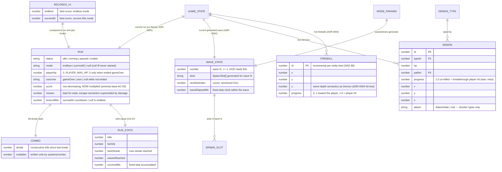

# Data model — survival-loop

> **Adaptation note.** Same client-only adaptation as the base feature
> ([basic-shooting-range/data-model.md](../basic-shooting-range/data-model.md)): the model
> is the in-memory storage contract — TypeScript types in `src/core/state.ts` are the
> schema, this document is the design rationale. **New this feature:** the per-mode record
> is the project's first persisted datum — reopen-trigger #1 of
> [`.claude/rules/migrations.md`](../../../.claude/rules/migrations.md) has FIRED; the
> localStorage contract below is now active (ADR-0003). SQL migrations remain N/A.
>
> This is a **delta document**: base entities (`Weapon`, `Shot`, `FireIntent`, `Path`,
> `SpawnSlot`) are unchanged and stay documented in the base data-model; entities below are
> new or amended.

## ER diagram

## Entities

Aggregate root: unchanged — **`GameState`** (`src/core/state.ts`); systems mutate it on the
fixed step. The persisted `RecordsV1` document is deliberately OUTSIDE the aggregate: it is
owned by `storage/records.ts` (ADR-0003), read once at boot into memory, compared/written
at run end via `wiring.ts` — the simulation never touches it.

### `GameState` (aggregate root — delta)

| Field | Type | Constraints / invariants | Notes |
|---|---|---|---|
| `run` | `Run` | exactly one | renamed from `round` (ADR-0001); code identifiers migrate with the type |
| `wave` | `WaveState` | exactly one | current generated wave lives IN the aggregate — determinism is asserted on state, not on system internals |
| `fireballs` | `Fireball[]` | only live fireballs; `demons.length + fireballs.length ≤ ENTITY_CAP (32)` | first-class entity kind (ADR-0004); cap enforced by the shared helper at BOTH spawn sites (SAD critic fix) |
| `demons`, `shots`, `fireIntents`, `weapon` | — | unchanged | base contract |

### `Run` (ex-`Round`, ADR-0001)

| Field | Type | Constraints / invariants | Notes |
|---|---|---|---|
| `status` | `'idle' \| 'running' \| 'paused' \| 'ended'` | one-way freeze on `ended` kept; `idle` = start/end screens shown, gameplay input dropped (AC-12) | `idle` is new (ADR-0001/0005) |
| `mode` | `'endless' \| 'survive60' \| null` | `null` iff never started; retry keeps the mode (AC-04) | picked on the start screen (US-09) |
| `playerHp` | `number` | integer `0..PLAYER_MAX_HP` (5); every player hit −1 (PRD §8); `0` ⇒ `ended`/`gameOver` same step | AC-01, AC-02 |
| `outcome` | `'gameOver' \| 'won' \| null` | `null` while not `ended`; `won` only in survive60 (AC-13) | drives end-screen variant |
| `score` | `number` | ≥ 0, integer, **non-decreasing** | now multiplied (combo × kill points + far-kill bonus) — amends base flat-score AC-03; invariant survives the amendment |
| `misses` | `number` | ≥ 0 | kept for stats; base "escaped = miss" is superseded by the breakthrough player hit — final semantics <!-- TBD: keep as shots-missed only, or retire; decide in break-tasks --> |
| `timeLeftMs` | `number \| null` | survive60: 60000 → 0 on the fixed step, 0 ⇒ `won`; endless: `null` (no timer end) | base ADR-0004 timer branch becomes per-mode |
| `combo` | `Combo` | exactly one | resets with the run by construction |
| `stats` | `RunStats` | exactly one | accumulated on the fixed step, never persisted (Non-goal N7) |
| ~~`scheduledCount`/`resolvedCount`~~ | — | **removed** | fixed-schedule end-condition retires with WAVE_SCHEDULE (ADR-0002); wave bookkeeping lives in `WaveState` — internal breaking change, flagged in PRD |

### `Combo` (on `Run`)

| Field | Type | Constraints / invariants | Notes |
|---|---|---|---|
| `streak` | `number` | ≥ 0, integer; +1 per kill; → 0 on break (player hit or escaped demon, NOT a missed shot — PRD §8) | fireball shoot-down neither grows nor breaks it (AC-14) |
| `multiplier` | `number` | ≥ 1; single writer = `systems/combo.ts`, derived from `COMBO_TABLE` at streak change | HUD/score read the stored value; reset to base on break leaves earned score untouched (AC-05) |

### `RunStats` (on `Run`)

| Field | Type | Constraints / invariants | Notes |
|---|---|---|---|
| `kills` | `number` | ≥ 0 | |
| `farKills` | `number` | ≥ 0, ≤ `kills` | far-kill = demon before path midpoint (PRD §8) |
| `bestStreak` | `number` | ≥ 0, = max streak reached | "best moment" input |
| `wavesReached` | `number` | ≥ 1 once running | mirrors `wave.number` at end |
| `survivedMs` | `number` | ≥ 0, fixed-step accumulated — never wall-clock | rank input; also the endless "how long" stat |

`systems/rank.ts` is a pure function `(score, stats) → { rank: 'D'..'S', bestMoment }` over
this object plus `RANK_TABLE` — rank/stats are computed at run end and NOT stored (US-07).

### `Fireball` (new entity kind, ADR-0004)

| Field | Type | Constraints / invariants | Notes |
|---|---|---|---|
| `id` | `number` | unique per run, incremental per entity kind (SAD §8) | separate counter from demons |
| `x`, `y`, `z` | `number` | same coordinate/depth semantics as `Demon` | hit-test resolves front-most by `z` ACROSS demons + fireballs (AC-15) |
| `progress` | `number` | `0..1` toward the player; `1.0` ⇒ player hit (−1 HP), despawn | speed = `FIREBALL_PARAMS.speed`, advanced only on the fixed step |

Shot down ⇒ despawn harmlessly: no points, combo untouched (AC-14).

### `Demon` (delta)

| Field | Type | Constraints / invariants | Notes |
|---|---|---|---|
| `attack` | `AttackState \| null` | `null` for non-shooter types; `{ cooldownRemainingMs, telegraphRemainingMs }`, both ≥ 0, decremented on the fixed step | `telegraphRemainingMs > 0` = winding up; reaching 0 spawns a `Fireball` at the demon's position (`systems/fireball.ts` is the single writer) |
| `progress` reaching `1.0` | — | **semantics change:** un-killed breakthrough ⇒ despawn + player hit (−1 HP) | was: despawn + miss (base AC-05) |

Zigzag demons (US-12) need **no schema change** — weaving is expressed as new `Path`
waypoint entries; the existing `waypoints: {x,y,z}[]` contract already carries it.

### Static config (delta — typed module constants, values-only per migrations.md)

| Entity | Fields | Notes |
|---|---|---|
| `MODE_PARAMS` | per mode: escalation params (density/speed/toughness growth per wave), `survive60` pinned high-intensity + `durationMs: 60000` | one parametric generator, two param sets (ADR-0002); concrete curve values = §11 tuning debt (3-evening budget) |
| `PLAYER_MAX_HP` / hit damage | `5` / `−1` per hit | PRD §8 locked defaults |
| `COMBO_TABLE` | streak thresholds → multiplier steps | values <!-- TBD: tuning, break-tasks --> |
| `FAR_KILL_PARAMS` | threshold = path midpoint (`progress < 0.5`), flat bonus | PRD §8 |
| `RANK_TABLE` | fixed score/stats thresholds for D/C/B/A/S | fixed table, tuned once (PRD §8) |
| `FIREBALL_PARAMS` | speed, telegraph ms, attack cooldown | stage-3 tuning |
| `ENTITY_CAP` | `32` | PRD NFR; enforced via one shared helper at both spawn sites |
| `DemonType` (delta) | `+ attackSpec?` (marks shooter-capable types), new zigzag `Path` entries | `WAVE_SCHEDULE` constant **retires** (ADR-0002) |

## Access patterns (index-analog)

Base patterns stay; delta:

| Pattern | Structure / strategy | Flow it serves | Justification |
|---|---|---|---|
| Hit-test across kinds: front-most by `z` over demons + fireballs | single linear scan over both arrays | §6 US-12 / flow 4 (AC-15, AC-14) | combined n ≤ 32 (ENTITY_CAP) — O(n) per shot, no sorted structure to maintain (ADR-0004) |
| Entity-cap check before any spawn | `demons.length + fireballs.length` O(1) | §6 US-03 (cap clamp branch) | shared helper, both spawn sites |
| Due spawn slots within wave N | cursor `wave.nextSlotIndex` into time-sorted slots | §6 US-03 | same amortized-O(1) discipline as the base schedule cursor, now per generated wave |
| Wave rollover check | wave slots exhausted + wave demons resolved → generate N+1 | §6 US-03 | O(1) counters + generator pure call; no scan of history |
| Record compare at run end | in-memory `RecordsV1` (read once at boot) | §6 flow 3 (AC-08/09/10) | zero storage reads during/after a run (SAD critic fix); per-mode field access O(1) |
| Rank at run end | pure fn over `run.stats` + `RANK_TABLE` | §6 flow 3 (AC-07) | computed once per run, nothing stored |
| End-condition per step | `playerHp === 0` / `timeLeftMs === 0` field checks | §6 flow 2 / US-10 | O(1), replaces retired resolved-vs-scheduled counters |

## Storage & migrations — localStorage contract (ACTIVE, ADR-0003)

Reopen-trigger #1 of `.claude/rules/migrations.md` has fired: the per-mode best score
persists. The pre-committed defaults apply as written; concretely:

- **Key:** `doom-shooter.v1` — single namespaced versioned key, one JSON document.
- **Schema v1:** `{ "endless": number, "survive60": number }` — non-negative integers,
  nothing else. No PII by construction (PRD §6.1).
- **Owner module:** `src/storage/records.ts` — the ONLY localStorage touchpoint.
  Read once at boot (missing key ⇒ defaults `{ endless: 0, survive60: 0 }` — the
  bootstrap-seed analog), compared in memory, written on run end when beaten.
- **Fail-soft (AC-10):** any read/parse error ⇒ defaults + session-only flag; any write
  error swallowed. The end screen never depends on storage health.
- **Migration contract:** schema bump = code migration next to the type: on load read
  `doom-shooter.v<N-1>`, transform, write `v<N>`, delete the old key; **one unit test per
  version step.** v1 is the first version — the only "migration" today is
  missing-key ⇒ defaults, which gets its own unit test.
- **Cross-mode isolation (AC-09):** per-mode fields in one document; compare/update only
  the finished run's mode field.
- SQL migrations / seeds / expand-backfill-contract: still N/A (no database; trigger #2
  untouched).

## Test fixtures

Same discipline as base: factories in test code — `makeRun(overrides?)`,
`makeFireball(overrides?)`, `makeWaveState(overrides?)` extend the existing
`makeGameState`/`makeDemon`; every existing factory gains the new `Run` fields
(ADR-0001's accepted wide-but-mechanical diff). Record-store tests use an injected
storage stub (in-memory `getItem`/`setItem` + fault injection for AC-10) — never the real
`window.localStorage` in unit tests. PII guard trivially satisfied (scores only).

## TBDs

- `run.misses` final semantics (keep as shots-missed vs retire) — decide in break-tasks.
- Concrete tuning values: `COMBO_TABLE` steps, `MODE_PARAMS` escalation curve (3-evening
  budget, SAD §11 High risk), `RANK_TABLE` thresholds, `FIREBALL_PARAMS` — all schema-stable,
  values are accepted tuning debt.
