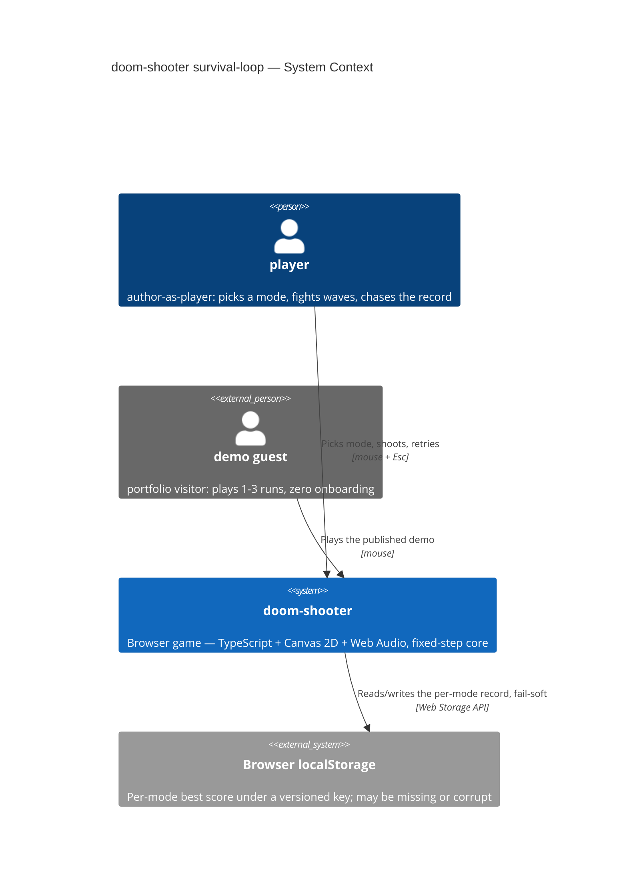
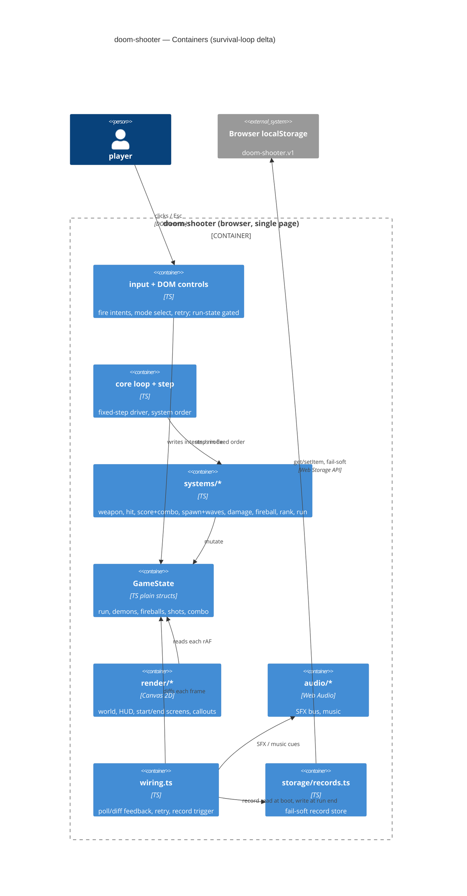
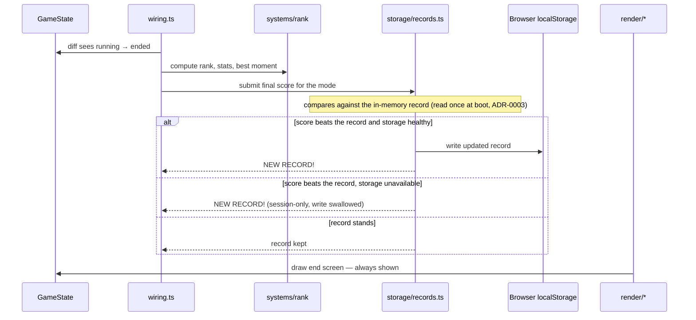

# Software Architecture Document — survival-loop

<!-- Stages 04-05 → see sdlc/plugin/skills/architecture-design/SKILL.md -->
<!-- 12 Arc42 sections. Empty sections — <!-- N/A: <one-line reason> -->. -->
<!-- C4 Context (L1) lives inline in §3. C4 Container (L2) lives inline in §5. -->
<!-- Заповнений приклад: див examples/course-lesson-mvp/sad.md у sdlc/ toolkit. -->

## 1. Introduction and goals

<!-- 🎯 Навіщо: стабільна памʼять про «що + три головні якості + хто зацікавлений».     -->
<!--           Через рік ніхто не згадає на словах, ЯКІ ТРИ ЯКОСТІ для системи критичні. -->
<!-- 📋 Що писати: 1 абзац intent + 3 рядки топ-3 якості + таблиця stakeholders.        -->
<!-- 📌 Приклад: «QG-1: швидкість редагування блоку p95 ≤500 мс»                         -->

**Intent.** survival-loop turns the polished shooting gallery into a survival arcade: the player gains HP and a lose condition (game over), two modes — Endless with generated escalating waves and Survive-60s with a timer win — a kill-streak combo multiplier with far-kill bonuses, a D–S rank with stats on the end screen, and a per-mode best score persisted between sessions. Shipped in three independently playable stages (PRD §2, idea-brief §13, Approach C).

**Top-3 quality goals (1-liners; full scenarios in §10):**

1. **Determinism preserved** — waves/combo/fireballs advance only on the fixed step, 0 wall-clock reads; timing drift ≤ 1% between 60 ↔ 144 Hz.
2. **Late-wave performance** — ≥ 30 FPS (frame-time p95 ≤ 33.3 ms) with the ≤ 32 live-entity cap active.
3. **Fail-soft record persistence** — 100% of runs reach their end screen with storage unavailable or corrupt.

Candidate #4 left out deliberately: player-hit feedback latency ≤ 100 ms is inherited from game-feel — the mechanism is already proven, it only extends to the new hit sources.

**Stakeholders.**

| Role | Interest | Sign-off owner? |
|---|---|---|
| player (author-as-player) | real stakes, voluntary "one more try" | No |
| demo guest | replay pull within 1-3 runs, zero onboarding | No |
| author-as-learner | first M-sized feature through the full SDLC pipeline | No |
| Tech Lead | SAD approval | Yes |

## 2. Constraints

<!-- 🎯 Навіщо: §4 (стратегія) працює тільки коли §2 зафіксувала, ЩО ВЖЕ ЗАФІКСОВАНО:    -->
<!--           стек, версії, дедлайн, регуляторні вимоги. Це вхід, не вихід.             -->
<!-- 📋 Що писати: чотири блоки — Технічні / Організаційні / Конвенції / Регуляторні.     -->
<!-- 📌 Приклад: «Postgres 18» (не «Postgres»); «дедлайн Q3 — жорсткий» (не «бажано»).    -->

**Technical.**
- TypeScript 5.7 (ESM), no runtime framework — vanilla Canvas 2D + Web Audio.
- Vite 6 (build/dev), Vitest 2.1 (unit), Playwright 1.49 (E2E), ESLint 9 + typescript-eslint 8.
- Browser-only client, no backend (PRD Non-goal N2).
- Fixed-step core: `STEP_MS = 1000/60`, `MAX_STEPS_PER_FRAME = 5`; systems never read wall-clock (basic-shooting-range ADR-0004).
- One central mutable `GameState`, plain structs, no ECS (basic-shooting-range ADR-0003); system order fixed in `src/core/step.ts`.
- Render/audio decoupled via poll/diff wiring — the fixed step stays event-free (game-feel convention).

**Organisational.**
- Solo dev, personal pet-project — no hard deadline.
- Endless tuning budget: 3 tuning evenings (PRD §8 default); fallback — Survive-60s becomes the primary mode.
- Delivery in 3 stages, each ending green and playable (PRD §2).

**Conventions.**
- `.claude/rules/migrations.md` — storage contract: **this feature fires reopen-trigger #1** → versioned localStorage key `doom-shooter.v<N>`, one JSON document, version bump = migration with a unit test per step, no PII ever.
- `src/core/config.ts` holds data only; invariants live in `src/systems/*`.
- IDs: in-memory incremental integers per entity kind.
- E2E via `?e2e` debug API (`window.__doom`); unit factories in `tests/factories.ts` mirror state defaults.

**Regulatory / external.**
- None. No PII (storage rules); record tampering via devtools accepted (PRD §6.1); license-clean asset sources only.

## 3. Context and scope

<!-- 🎯 Навіщо: малює КОРДОН СИСТЕМИ — хто з нею говорить ззовні, де закінчується зона довіри. -->
<!--           Без §3 §5 і §8 (авторизація) розпливаються — неясно, що «всередині», а що «зовні». -->
<!-- 📋 Що писати: 2-3 речення бізнес-контексту + таблиця зовнішніх систем + Mermaid C4Context. -->
<!-- 📌 Приклад: «зовнішні — нема (свідома відмова від third-party у v1)» — це теж рішення.   -->
<!-- Кордон довіри (trust boundary) — лінія, за якою ти не довіряєш даним без перевірки.       -->

A single-player browser game with no server: survival-loop adds a lose condition, modes, and a record, but barely moves the system boundary. The one new external system is the browser's localStorage — outside the trust boundary: it may be missing, full, or corrupt, and every read is parsed defensively (PRD AC-10). There is no network surface.

<!-- brownfield scan: Explore subagent ran 2026-07-12 — see §2 Technical + §5 for the reported layout. -->

**External systems (in / out):**

| Actor or system | Type | Interaction |
|---|---|---|
| player (author-as-player) | Person | picks a mode, shoots, retries, chases the record |
| demo guest | Person (external) | plays 1-3 runs of the published demo, zero onboarding |
| Browser localStorage | System (external) | holds the per-mode record under a versioned key; fail-soft reads/writes |

**C4 Context (L1):**



## 4. Solution strategy

<!-- 🎯 Навіщо: 3-4 СТРАТЕГІЧНІ СТОВПИ, з яких потім ростуть усі ADR. Без §4 кожен ADR    -->
<!--           виглядає випадковим — нема зонтика. ⭐ Найгустіша секція — тут ADR-gate    -->
<!--           спрацьовує майже завжди (рішення незворотні + мульти-модульні).            -->
<!-- 📋 Що писати: список з 3-4 виборів. На кожен — заголовок + 2-3 речення rationale.    -->
<!-- 📌 Приклад: «Зберігати урок як таблицю блоків» — стовп, з якого виросло ADR-0001.    -->

**Top-5 strategic choices (the seeds for ADRs):**

1. **Extend `Round` into a mode-aware run state (ADR-0001).** The existing one-way freeze, pause, `isRoundActive` gate, and test factories are reused; `mode` (`endless` | `survive60`), `playerHp`, terminal `outcome` (`gameOver` | `won` | `null`), and an `idle` status for the start screen join the same object. One source of truth for the game phase keeps the E2E debug API and the render/wiring observers simple (QG-1 determinism: all transitions happen on the fixed step).
2. **Single parametric wave generator for both modes (ADR-0002).** A pure function `(waveNumber, modeParams) → wave spec`, consumed on the fixed step when the current wave is exhausted, replaces the retired static `WAVE_SCHEDULE`. Endless escalates the parameters; Survive-60s pins the same formulas at high intensity (PRD §8 default) — one code path, one determinism test.
3. **Record behind a fail-soft storage adapter (ADR-0003).** A dedicated module is the only touchpoint with localStorage: one defensive read at boot (garbage/absence → defaults + session-only flag), one write at run end, every error swallowed. Schema `doom-shooter.v1` = `{ endless: number, survive60: number }` per the migrations.md contract; the game loop never touches storage (QG-3 fail-soft by construction).
4. **Fireball as a first-class shootable entity kind (ADR-0004).** `state.fireballs[]` lives beside `demons[]`; hit resolution generalizes to "front-most by depth across all shootable kinds" (AC-15). The fireball inherits nothing demon-specific (no path-walking, HP tiers, or score value — per CONTEXT glossary); the ≤ 32 entity cap counts both lists (QG-2).
5. **Screens follow the existing hybrid convention (ADR-0005).** The start screen and end screens are drawn by the canvas renderer off the run status (like today's round-result overlay); interactive controls (mode select, retry) are DOM buttons toggled by status. The first click on a mode button arms audio (AC-11); gameplay input is gated on `status === 'running'` (AC-12).

**Gameplay defaults locked at this gate (PRD §8 open questions closed, values as data in `config.ts`, invariants in `systems/*`):** player HP = 5, every player hit removes exactly 1; the combo breaks on a taken player hit or an escaped demon — never on a missed shot; far-kill threshold = the demon has not yet crossed the midpoint of its path; ranks D–S come from a fixed table tuned once during implementation. The escalation curve shape stays open as a tuning risk (§11) with the 3-evening budget from §2.

Each tactical decision in later sections should be traceable to one of these strategic seeds. Tactical decisions that *contradict* a strategic choice are red flags — surface them in §11 Risks.

## 5. Building block view

<!-- 🎯 Навіщо: ВНУТРІШНЯ ДЕКОМПОЗИЦІЯ — модулі, контейнери, БД. Статична топологія:   -->
<!--           хто з ким може говорити. Без §5 §6 (сценарії) не має словника учасників. -->
<!-- 📋 Що писати: 1 абзац про стиль (шари/гексагональна/clean/на подіях) +            -->
<!--           дерево папок + Mermaid C4Container.                                       -->
<!-- 📌 Приклад: «web-app, content-api, media-worker, postgres, s3, cdn».                -->

The style is unchanged from the base game: a fixed-step **logic core** (small systems — pure functions mutating one central `GameState`, order fixed in `step.ts`) with **decoupled render/audio** observing state via poll/diff. The feature's new logic lands as five small systems following the existing `systems/*` granularity, one new entity, and one new `storage/` directory for the record adapter (its only localStorage touchpoint, ADR-0003).

**Internal decomposition (feature delta):**

```
src/
├── core/
│   ├── state.ts        ← Run (ex-Round): + mode, playerHp, outcome, 'idle' status; + fireballs[]; + combo
│   ├── config.ts       ← + mode params, escalation params, HP/damage, combo/far-kill, rank table
│   └── step.ts         ← + step order: waves → fireball → damage → run end-conditions
├── systems/
│   ├── waves.ts        NEW — parametric wave generator + entity-cap enforcement (ADR-0002)
│   ├── damage.ts       NEW — player hits (breakthrough demon, landed fireball), game-over trigger
│   ├── combo.ts        NEW — kill-streak multiplier + far-kill bonus
│   ├── fireball.ts     NEW — telegraph, flight, shoot-down resolution (stage 3)
│   ├── rank.ts         NEW — rank D–S, run stats, best-moment line (pure function of the finished run)
│   ├── score.ts        ← multiplied scoring, stays non-decreasing
│   ├── hit.ts          ← front-most by z across demons + fireballs (ADR-0004)
│   ├── round.ts        ← run semantics: hp = 0 → gameOver; survive60 timer → won (ADR-0001)
│   └── spawn.ts        ← consumes generator output instead of WAVE_SCHEDULE
├── entities/fireball.ts NEW — typed struct + derived helpers
├── storage/records.ts   NEW — fail-soft record store (ADR-0003)
├── render/canvas2d.ts   ← start/end screens, HP indicator, wave number, combo HUD, callouts
├── wiring.ts            ← run-end → rank/record trigger; callouts via poll/diff
└── main.ts              ← mode buttons, screen-button visibility (ADR-0005)
```

**C4 Container (L2):**



## 6. Runtime view

<!-- 🎯 Навіщо: ПОТІК У RUNTIME для 1-2 критичних сценаріїв. Хто з ким коли і у якому     -->
<!--           порядку говорить. Без §6 §5 — лише купа коробок без життя.                  -->
<!-- 📋 Що писати: Mermaid sequenceDiagram. Учасники — імена з §5 (не вигадуй нові!).      -->
<!--           Повідомлення семантичні («складає чорновик»), БЕЗ HTTP-методів/шляхів —     -->
<!--           ендпоінт-рівневі sequence-діаграми зʼявляться у stage 06 (define-api).      -->
<!-- 📌 Приклад: «methodist → web-app: складає чорновик → web-app → content-api: зберегти». -->

Start screen (US-09) and retry (US-04) are deliberately not diagrammed — they are trivial status transitions covered by ADR-0001/0005 prose. Critical flows 1-4 below cover US-01/02/07/08/11; the `### US-NN` sections after them complete the coverage for the remaining stories (stage 06).

**Critical flow 1: breakthrough demon → player hit (AC-01)**

```mermaid
sequenceDiagram
    participant loop as core loop
    participant systems as systems/*
    participant state as GameState
    participant wiring as wiring.ts
    participant renderer as render/*
    participant audio as audio/*
    loop->>systems: fixed step
    systems->>state: demon progress reaches 1 (un-killed)
    systems->>state: damage: despawn demon, playerHp -= 1
    wiring->>state: diff (next rendered frame)
    wiring->>audio: player-hit SFX
    wiring->>renderer: strong screen feedback (flash/shake)
    renderer->>state: read HP for HUD indicator
```

**Critical flow 2: same-step final kill + fatal hit (AC-02b, ordering edge)**

```mermaid
sequenceDiagram
    participant loop as core loop
    participant systems as systems/*
    participant state as GameState
    loop->>systems: fixed step (step.ts order)
    systems->>state: hit: killing shot resolves
    systems->>state: score+combo: kill points × multiplier (+ far-kill bonus)
    systems->>state: damage: player hit lands, playerHp hits 0
    systems->>state: run end-condition: outcome = gameOver, one-way freeze
    Note over systems,state: score is written before the freeze — order fixed in step.ts
```

**Critical flow 3: run end → rank + record, fail-soft branch (AC-07/08/10)**



**Critical flow 4: fireball counterplay (AC-14, stage 3)**

```mermaid
sequenceDiagram
    participant loop as core loop
    participant systems as systems/*
    participant state as GameState
    participant wiring as wiring.ts
    loop->>systems: fixed step
    systems->>state: shooter demon telegraphs, spawns fireball
    alt player shoots it down
        systems->>state: hit: front-most across kinds = fireball
        systems->>state: fireball despawns harmlessly (no points, combo untouched)
    else fireball reaches the player
        systems->>state: damage: player hit, playerHp -= 1
        wiring->>state: diff → strong feedback
    end
```

### US-03: Fight endless escalating waves (AC-03)

```mermaid
sequenceDiagram
    participant loop as core loop
    participant systems as systems/*
    participant state as GameState
    participant renderer as render/*
    Note over state: Precondition: endless run in progress, wave N live
    loop->>systems: fixed step
    systems->>state: waves: wave N exhausted → advance to N+1
    systems->>state: waves: generate N+1 params (denser / faster / tougher per escalation rule)
    alt entity cap would be exceeded (ADR-0002)
        systems->>state: waves: clamp density, escalation continues on speed/toughness
    end
    systems->>state: spawn: consume generator output, place N+1 demons
    renderer->>state: read wave number for HUD
    Note over state: Postcondition: wave N+1 strictly harder, number visible
```

### US-05: Build a kill-streak combo (AC-05)

```mermaid
sequenceDiagram
    participant loop as core loop
    participant systems as systems/*
    participant state as GameState
    participant renderer as render/*
    Note over state: Precondition: run in progress
    loop->>systems: fixed step
    systems->>state: hit: killing shot resolves
    systems->>state: combo: streak++ → multiplier grows
    systems->>state: score: kill points × multiplier
    renderer->>state: read combo for HUD
    alt combo break occurs (per combo-break rule)
        systems->>state: combo: multiplier resets to base
        Note over systems,state: earned score untouched — score stays non-decreasing (AC-05)
        systems->>state: score: subsequent kills at base until a new streak
    end
```

### US-06: Earn far-kill bonuses (AC-06)

```mermaid
sequenceDiagram
    participant loop as core loop
    participant systems as systems/*
    participant state as GameState
    participant wiring as wiring.ts
    participant renderer as render/*
    Note over state: Precondition: live demon beyond the far-kill threshold (config)
    loop->>systems: fixed step
    systems->>state: hit: killing shot resolves
    systems->>state: combo: far-kill check — distance beyond threshold
    systems->>state: score: far-kill bonus on top of multiplied kill points
    wiring->>state: diff (next rendered frame)
    wiring->>renderer: "SNIPED!" callout
    alt demon already within threshold
        systems->>state: score: multiplied kill points only, no bonus, no callout
    end
```

### US-10: Win by surviving 60 seconds (AC-13)

```mermaid
sequenceDiagram
    participant loop as core loop
    participant systems as systems/*
    participant state as GameState
    participant wiring as wiring.ts
    participant renderer as render/*
    Note over state: Precondition: survive-60s run in progress, playerHp > 0
    loop->>systems: fixed step (step.ts order)
    opt same-moment final kill
        systems->>state: hit: killing shot resolves
        systems->>state: score+combo: kill points × multiplier (+ far-kill bonus)
    end
    systems->>state: run end-condition: 60s timer expired → outcome = won, one-way freeze
    Note over systems,state: kill scored before the freeze — same step.ts order as AC-02b
    wiring->>state: diff sees running → ended
    wiring->>state: rank + record trigger (see flow 3)
    renderer->>state: draw win screen — not game over
    alt playerHp hits 0 before the timer
        systems->>state: run end-condition: outcome = gameOver (flow 2 path)
    end
```

### US-12: Face zigzag demons (AC-15)

```mermaid
sequenceDiagram
    participant loop as core loop
    participant systems as systems/*
    participant state as GameState
    Note over state: Precondition: zigzag demon and fireball overlap under the crosshair at different depths
    loop->>systems: fixed step
    systems->>state: spawn: zigzag demon takes a weaving path (typed config, no new logic)
    systems->>state: hit: player fires — collect candidates under crosshair across kinds
    systems->>state: hit: resolve single hit to front-most by z, demons + fireballs (ADR-0004)
    alt front-most is the zigzag demon
        systems->>state: kill resolves: score+combo as usual
    else front-most is the fireball
        systems->>state: fireball despawns harmlessly (flow 4 rules)
    end
```

## 7. Deployment view

<!-- 🎯 Навіщо: ТОПОЛОГІЯ, яку DevOps має знати без читання Helm-чартів — скільки реплік,  -->
<!--           де живе фоновий обробник, ПРИ ЯКИХ ЧИСЛАХ масштабуємось.                     -->
<!-- 📋 Що писати: 2-3 речення про топологію + метрики + алерти + конкретні числа-пороги.   -->
<!-- 📌 Приклад: «500 IC → партиціонування за кварталом» (не «при зростанні подумаємо»).    -->
<!-- 🎯 Можна N/A для XS/S функцій, що переюзають існуюче розгортання без змін.            -->

Topology unchanged: a static Vite build, single page, no server; publishing the demo remains parked (post-feature). The feature adds no deployment unit — everything ships inside the same bundle.

**Monitoring:**
- Frame-time: existing `createFrameTimer` FPS dev overlay (rolling mean + p95) — the measurement source for QG-2.
- No alerts or tracing — client-side game, no ops surface.

**Scaling thresholds:**
- ≤ 32 concurrent live entities (demons + fireballs) at any wave — the single performance guard for late waves; a shared cap helper sums both lists and is consulted by both spawn sites — the wave generator (ADR-0002) and the fireball system (ADR-0004) — asserted by a stress test.

## 8. Crosscutting concepts

<!-- 🎯 Навіщо: НАСКРІЗНІ ПАТЕРНИ, які перетинають кілька модулів: логування, помилки,    -->
<!--           авторизація, ID strategy, outbox, кеш. ⭐ Друга найгустіша секція.          -->
<!--           Якщо патерн всередині одного модуля — він НЕ сюди. Якщо це конвенція        -->
<!--           проєкту в цілому — у CLAUDE.md.                                              -->
<!-- 📋 Що писати: таблиця концепт / конвенція / де визначено. Один рядок на концепт.      -->
<!-- 📌 Приклад: «UUID v7 (час+випадковий, сортується) у app-layer» — як default з CLAUDE.md. -->

| Concept | Convention | Where defined |
|---|---|---|
| Determinism | systems never read wall-clock; render/effects age by rAF delta | basic-shooting-range ADR-0004, §2 |
| Feedback wiring | poll/diff each rendered frame; the fixed step stays event-free | game-feel, `src/wiring.ts` |
| Error handling | fail-soft: assets and storage degrade silently, play is never blocked | base AC-06 pattern, ADR-0003 |
| ID strategy | in-memory incremental integers per entity kind | storage rules / base SAD §8 |
| Config-as-data | values in `src/core/config.ts`, invariants in `src/systems/*` | `.claude/rules/migrations.md` |
| Input gating | gameplay input only while `status === 'running'` (extends focus/scope gating) | AC-12, ADR-0001 |
| Audio | single bus, first-gesture arming, 8-voice steal-oldest, `musicGain` seam | game-feel |
| Persistence | versioned key `doom-shooter.v<N>`, no PII, version bump = migration + unit test | `.claude/rules/migrations.md` |
| Internationalisation | N/A — English only | — |

## 9. Architecture decisions

<!-- 🎯 Навіщо: ЗВОРОТНИЙ ІНДЕКС на папку adr/. `ls adr/` дає файли, §9 дає семантику —    -->
<!--           чому вони існують, до якого зрізу SAD привʼязані, у якому статусі.           -->
<!-- 📋 Що писати: таблиця з 4 колонками. Один рядок на ADR. Mixed status — це OK.         -->
<!-- 📌 Приклад: «0001 | Зберігати урок як таблицю блоків | Accepted | §4».                -->

| # | Title | Status | Section |
|---|---|---|---|
| 0001 | Extend Round into a mode-aware run state | Accepted | §4 |
| 0002 | Use a single parametric wave generator for both modes | Accepted | §4 |
| 0003 | Put the per-mode record behind a fail-soft store with a versioned localStorage key | Accepted | §4 |
| 0004 | Model the fireball as a first-class shootable entity kind | Accepted | §4 |
| 0005 | Build start/end screens as canvas visuals with DOM controls | Accepted | §4 |

ADR files live under `docs/features/survival-loop/adr/NNNN-<title>.md`.

## 10. Quality requirements

<!-- 🎯 Навіщо: ДЕРЕВО ЯКОСТЕЙ (Quality Tree) — беремо мету з §1 і розкладаємо на          -->
<!--           конкретні листя: тести, метрики, конфіги, drill-и. ⭐ Без §10 §1 — це       -->
<!--           маніфест. З §10 кожна декларація мапиться на щось, ЩО МОЖНА ДОВЕСТИ.        -->
<!-- 📋 Що писати: на кожну якість з §1 — When / Then / How verify. Числа з PRD §6 NFR     -->
<!--           ДОСЛІВНО (не округлюй p95 ≤250мс до ≤300мс — це F6-помилка критика).        -->
<!-- 📌 Приклад: «p95 ≤500 мс на UPDATE блоку, перевіримо k6 load test 100 req/s».        -->

Each top-3 goal from §1 expanded into a full scenario (numbers verbatim from PRD §6 NFR):

**QG-1. Determinism preserved**
- **When:** the same run advances at 60 Hz and at 144 Hz refresh rates.
- **Then:** timing drift ≤ 1%; waves/combo/fireballs advance only on the fixed step, 0 wall-clock reads.
- **How verify:** the existing elapsed-time unit test on two simulated refresh rates, extended to generated waves.

**QG-2. Late-wave performance**
- **When:** a late-wave stress run with the entity cap active.
- **Then:** ≥ 30 FPS (frame-time p95 ≤ 33.3 ms); concurrent live entities (demons + fireballs) ≤ 32 at any moment, any wave.
- **How verify:** rAF frame-time profiler (existing `createFrameTimer`) during a late-wave stress run + a unit/stress test asserting the cap under a long generated run.

**QG-3. Fail-soft record persistence**
- **When:** storage is unavailable or holds corrupt data when a run ends.
- **Then:** 100% of runs reach their end screen; the record degrades to session-only and the player is never blocked from playing.
- **How verify:** E2E run with storage disabled/corrupted.

## 11. Risks and technical debt

<!-- 🎯 Навіщо: ⭐ збирає ВСЕ, що може зламатись — і не лише технічне. Без §11 ризики   -->
<!--           обговорюються на стендапах і губляться; борг лишається у голові того,    -->
<!--           хто його прийняв.                                                          -->
<!-- 📋 Що писати: таблиця ризик/борг — серйозність — мітигація — власник. Технічний    -->
<!--           борг окремою секцією.                                                      -->
<!-- 📌 Приклад: «EM не пушить — member не оновлює дані | High | …». Перший ризик —      -->
<!--           часто продуктовий, не технічний. Це нормально.                            -->

<!-- Severity column literals: Low / Medium / High for regular risks; "Open question" for rows
     created by Step-7 `Save as Open Question` resolutions (see references/socratic-loop.md). -->

| Risk / debt | Severity | Mitigation | Owner |
|---|---|---|---|
| Endless escalation may not be fun within the tuning budget | High | 3 tuning evenings (§2); fallback: Survive-60s becomes the primary mode (PRD §8) | Maksym |
| The ≤ 32 entity cap may flatten late-wave difficulty once escalation hits it | Medium | escalate speed/toughness after density caps out; observe wave feel in the stress run | Maksym |
| Existing unit/E2E tests assume an auto-starting round — the start screen breaks them | Medium | extend the `?e2e` debug API with a mode/auto-start parameter; budget test repair explicitly in break-tasks | Maksym |
| Combo HUD + callouts add per-frame allocations → GC hitches in late waves | Low | reuse the effects pooling patterns; watch frame-time p95 (QG-2) | Maksym |
| Base glossary amendments (score, round) pre-announced at PRD approval are not yet applied | Low | update the base CONTEXT entries when implementation starts | Maksym |

**Accepted debt (acceptable in v1, plan to fix later):**
- Rank thresholds are a fixed table tuned once — after wave tuning they may drift out of line with actual difficulty; re-tune in a follow-up.
- Zigzag paths are fixed waypoint data (never computed) — may read as repetitive once learned; acceptable per CONTEXT boundary "NOT AI".

## 12. Glossary

<!-- 🎯 Навіщо: ⭐ СЛОВНИК ДОМЕНУ, який припиняє суперечки через рік («checkpoint —      -->
<!--           weekly чи biweekly? Quarter — календарний чи фіскальний?»).                -->
<!-- 📋 Що писати: таблиця термін / значення. Бізнес-терміни + технічні вперемішку.       -->
<!--           Один термін може мати дві мови у заголовку: «Goal (Обʼєктив)».              -->
<!-- 📌 Приклад: «Lesson | урок усередині курсу, що складається з блоків (text, video)». -->

Canonical definitions live in [CONTEXT.md](./CONTEXT.md); this table extracts the terms used in this SAD's body.

| Term | Meaning |
|---|---|
| run | one attempt at a mode, from start (or retry) to game over / win; NOT a session |
| game mode | the player-chosen ruleset for a run: Endless or Survive-60s; NOT a difficulty slider |
| player HP | the player's hit points; each breakthrough demon or landed fireball removes 1; NOT demon HP |
| player hit | the moment a path-completing demon or unblocked fireball damages the player, with strong feedback |
| game over | the run-ending state at player HP = 0 (score, stats, rank shown); NOT the survive-60s win |
| wave | a numbered generated group of demons; wave N+1 is denser/faster/tougher (amends the base term) |
| combo multiplier | score multiplier growing with consecutive kills, reset on a combo break; never rhythm-gated |
| far-kill bonus | extra points for killing a demon before it crosses the midpoint of its path |
| rank | the D–S letter grade of one run, from a fixed threshold table |
| record | the per-mode best score kept in the player's browser; NOT a leaderboard |
| start screen | the pre-run screen where the player picks a mode and arms audio; NOT a pause menu |
| fireball | a shooter-demon projectile, shootable mid-flight; NOT a demon (no path-walking, score, HP tiers) |
| zigzag path | fixed waypoint data weaving laterally while advancing; NOT AI |
| fixed step | the deterministic simulation tick (`STEP_MS = 1000/60`); all game logic advances on it |
| poll/diff wiring | the per-frame state-diff observer that emits SFX/effects, keeping the fixed step event-free |
| entity cap | the ≤ 32 limit on concurrent live demons + fireballs — a shared helper consulted by both spawn sites (wave generator + fireball system) |
