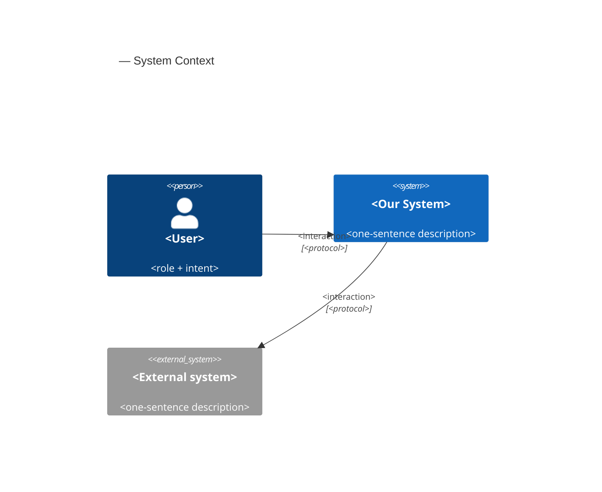
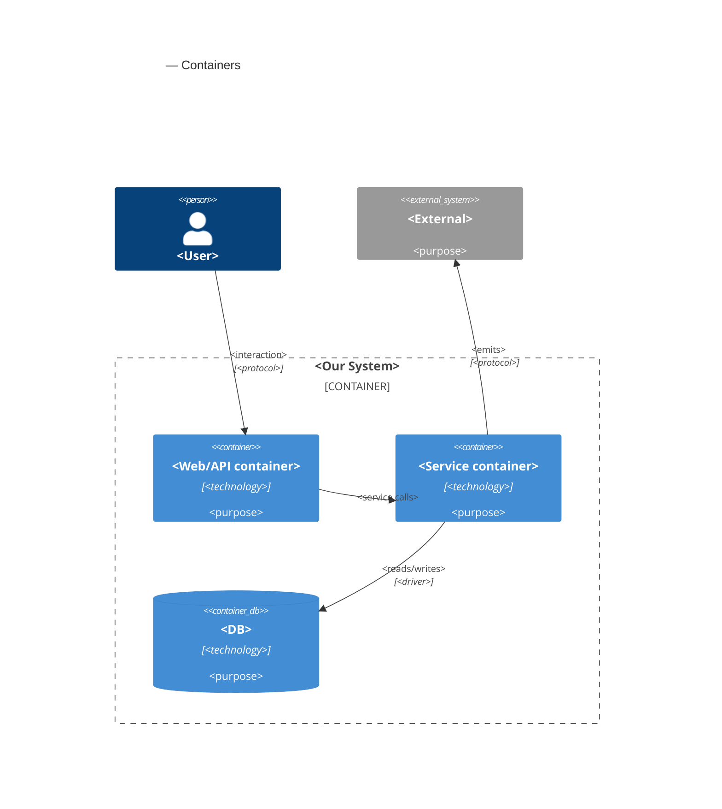
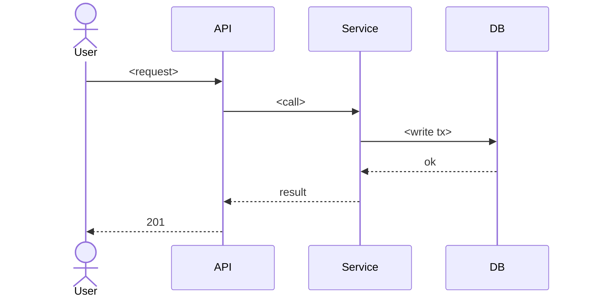

# Software Architecture Document — survival-loop

<!-- Stages 04-05 → see sdlc/plugin/skills/architecture-design/SKILL.md -->
<!-- 12 Arc42 sections. Empty sections — <!-- N/A: <one-line reason> -->. -->
<!-- C4 Context (L1) lives inline in §3. C4 Container (L2) lives inline in §5. -->
<!-- Заповнений приклад: див examples/course-lesson-mvp/sad.md у sdlc/ toolkit. -->

## 1. Introduction and goals

<!-- 🎯 Навіщо: стабільна памʼять про «що + три головні якості + хто зацікавлений».     -->
<!--           Через рік ніхто не згадає на словах, ЯКІ ТРИ ЯКОСТІ для системи критичні. -->
<!-- 📋 Що писати: 1 абзац intent + 3 рядки топ-3 якості + таблиця stakeholders.        -->
<!-- 📌 Приклад: «QG-1: швидкість редагування блоку p95 ≤500 мс»                         -->

**Intent.** survival-loop turns the polished shooting gallery into a survival arcade: the player gains HP and a lose condition (game over), two modes — Endless with generated escalating waves and Survive-60s with a timer win — a kill-streak combo multiplier with far-kill bonuses, a D–S rank with stats on the end screen, and a per-mode best score persisted between sessions. Shipped in three independently playable stages (PRD §2, idea-brief §13, Approach C).

**Top-3 quality goals (1-liners; full scenarios in §10):**

1. **Determinism preserved** — waves/combo/fireballs advance only on the fixed step, 0 wall-clock reads; timing drift ≤ 1% between 60 ↔ 144 Hz.
2. **Late-wave performance** — ≥ 30 FPS (frame-time p95 ≤ 33.3 ms) with the ≤ 32 live-entity cap active.
3. **Fail-soft record persistence** — 100% of runs reach their end screen with storage unavailable or corrupt.

Candidate #4 left out deliberately: player-hit feedback latency ≤ 100 ms is inherited from game-feel — the mechanism is already proven, it only extends to the new hit sources.

**Stakeholders.**

| Role | Interest | Sign-off owner? |
|---|---|---|
| player (author-as-player) | real stakes, voluntary "one more try" | No |
| demo guest | replay pull within 1-3 runs, zero onboarding | No |
| author-as-learner | first M-sized feature through the full SDLC pipeline | No |
| Tech Lead | SAD approval | Yes |

## 2. Constraints

<!-- 🎯 Навіщо: §4 (стратегія) працює тільки коли §2 зафіксувала, ЩО ВЖЕ ЗАФІКСОВАНО:    -->
<!--           стек, версії, дедлайн, регуляторні вимоги. Це вхід, не вихід.             -->
<!-- 📋 Що писати: чотири блоки — Технічні / Організаційні / Конвенції / Регуляторні.     -->
<!-- 📌 Приклад: «Postgres 18» (не «Postgres»); «дедлайн Q3 — жорсткий» (не «бажано»).    -->

**Technical.**
- TypeScript 5.7 (ESM), no runtime framework — vanilla Canvas 2D + Web Audio.
- Vite 6 (build/dev), Vitest 2.1 (unit), Playwright 1.49 (E2E), ESLint 9 + typescript-eslint 8.
- Browser-only client, no backend (PRD Non-goal N2).
- Fixed-step core: `STEP_MS = 1000/60`, `MAX_STEPS_PER_FRAME = 5`; systems never read wall-clock (basic-shooting-range ADR-0004).
- One central mutable `GameState`, plain structs, no ECS (basic-shooting-range ADR-0003); system order fixed in `src/core/step.ts`.
- Render/audio decoupled via poll/diff wiring — the fixed step stays event-free (game-feel convention).

**Organisational.**
- Solo dev, personal pet-project — no hard deadline.
- Endless tuning budget: 3 tuning evenings (PRD §8 default); fallback — Survive-60s becomes the primary mode.
- Delivery in 3 stages, each ending green and playable (PRD §2).

**Conventions.**
- `.claude/rules/migrations.md` — storage contract: **this feature fires reopen-trigger #1** → versioned localStorage key `doom-shooter.v<N>`, one JSON document, version bump = migration with a unit test per step, no PII ever.
- `src/core/config.ts` holds data only; invariants live in `src/systems/*`.
- IDs: in-memory incremental integers per entity kind.
- E2E via `?e2e` debug API (`window.__doom`); unit factories in `tests/factories.ts` mirror state defaults.

**Regulatory / external.**
- None. No PII (storage rules); record tampering via devtools accepted (PRD §6.1); license-clean asset sources only.

## 3. Context and scope

<!-- 🎯 Навіщо: малює КОРДОН СИСТЕМИ — хто з нею говорить ззовні, де закінчується зона довіри. -->
<!--           Без §3 §5 і §8 (авторизація) розпливаються — неясно, що «всередині», а що «зовні». -->
<!-- 📋 Що писати: 2-3 речення бізнес-контексту + таблиця зовнішніх систем + Mermaid C4Context. -->
<!-- 📌 Приклад: «зовнішні — нема (свідома відмова від third-party у v1)» — це теж рішення.   -->
<!-- Кордон довіри (trust boundary) — лінія, за якою ти не довіряєш даним без перевірки.       -->

<Business context in 2-3 sentences. What the system does for whom.>

**External systems (in / out):**

| Actor or system | Type | Interaction |
|---|---|---|
| <e.g. IC> | Person | Creates goals, adds checkpoints |
| <e.g. notification-service> | System (internal) | Receives cron registration |
| <e.g. Identity Provider> | System (external) | Provides JWT tokens |

**C4 Context (L1):**



## 4. Solution strategy

<!-- 🎯 Навіщо: 3-4 СТРАТЕГІЧНІ СТОВПИ, з яких потім ростуть усі ADR. Без §4 кожен ADR    -->
<!--           виглядає випадковим — нема зонтика. ⭐ Найгустіша секція — тут ADR-gate    -->
<!--           спрацьовує майже завжди (рішення незворотні + мульти-модульні).            -->
<!-- 📋 Що писати: список з 3-4 виборів. На кожен — заголовок + 2-3 речення rationale.    -->
<!-- 📌 Приклад: «Зберігати урок як таблицю блоків» — стовп, з якого виросло ADR-0001.    -->

**Top-3 strategic choices (the seeds for ADRs):**

1. **<e.g. Module isolation through events>** — <2-3 sentences rationale referencing Quality Goals and constraints>.
2. **<e.g. Single-store persistence (Postgres)>** — <2-3 sentences>.
3. **<e.g. Server-rendered dashboard>** — <2-3 sentences>.

Each tactical decision in later sections should be traceable to one of these strategic seeds. Tactical decisions that *contradict* a strategic choice are red flags — surface them in §11 Risks.

## 5. Building block view

<!-- 🎯 Навіщо: ВНУТРІШНЯ ДЕКОМПОЗИЦІЯ — модулі, контейнери, БД. Статична топологія:   -->
<!--           хто з ким може говорити. Без §5 §6 (сценарії) не має словника учасників. -->
<!-- 📋 Що писати: 1 абзац про стиль (шари/гексагональна/clean/на подіях) +            -->
<!--           дерево папок + Mermaid C4Container.                                       -->
<!-- 📌 Приклад: «web-app, content-api, media-worker, postgres, s3, cdn».                -->

<One paragraph: layered / hexagonal / clean / event-driven. Why.>

**Internal decomposition:**

```
<e.g. internal/modules/goals/>
├── domain/       <entities + sentinel errors>
├── app/          <use cases / services>
├── infra/        <repository + outbox impl>
├── ports/        <HTTP handlers, DTOs, error mapping>
└── module.go     <self-wiring>
```

**C4 Container (L2):**



## 6. Runtime view

<!-- 🎯 Навіщо: ПОТІК У RUNTIME для 1-2 критичних сценаріїв. Хто з ким коли і у якому     -->
<!--           порядку говорить. Без §6 §5 — лише купа коробок без життя.                  -->
<!-- 📋 Що писати: Mermaid sequenceDiagram. Учасники — імена з §5 (не вигадуй нові!).      -->
<!--           Повідомлення семантичні («складає чорновик»), БЕЗ HTTP-методів/шляхів —     -->
<!--           ендпоінт-рівневі sequence-діаграми зʼявляться у stage 06 (define-api).      -->
<!-- 📌 Приклад: «methodist → web-app: складає чорновик → web-app → content-api: зберегти». -->

**Critical flow 1: <flow name>**



<!-- For XS/S: 1 flow above is enough. For M+: add 2-4 more (e.g. failure-mode flow, async flow). -->

**Critical flow 2: <e.g. async event propagation>** — <if applicable, otherwise N/A>.

## 7. Deployment view

<!-- 🎯 Навіщо: ТОПОЛОГІЯ, яку DevOps має знати без читання Helm-чартів — скільки реплік,  -->
<!--           де живе фоновий обробник, ПРИ ЯКИХ ЧИСЛАХ масштабуємось.                     -->
<!-- 📋 Що писати: 2-3 речення про топологію + метрики + алерти + конкретні числа-пороги.   -->
<!-- 📌 Приклад: «500 IC → партиціонування за кварталом» (не «при зростанні подумаємо»).    -->
<!-- 🎯 Можна N/A для XS/S функцій, що переюзають існуюче розгортання без змін.            -->

<Topology in 2-3 sentences. Where it runs (k8s / VM / serverless), replicas, scaling thresholds.>

**Monitoring:**
- <Metrics — e.g. Prometheus `<metric_name>`>
- <Alerts — e.g. "outbox lag > 10 min → page on-call">
- <Tracing — e.g. OpenTelemetry HTTP spans>

**Scaling thresholds:**
- <e.g. 500 IC × 5 goals × 26 checkpoints/Q = 65k rows/year — comfortable in one table>
- <e.g. partitioning by quarter at >500k rows/year>

<!-- For XS/S that doesn't change deployment: <!-- N/A: feature reuses existing deployment unit -->. -->

## 8. Crosscutting concepts

<!-- 🎯 Навіщо: НАСКРІЗНІ ПАТЕРНИ, які перетинають кілька модулів: логування, помилки,    -->
<!--           авторизація, ID strategy, outbox, кеш. ⭐ Друга найгустіша секція.          -->
<!--           Якщо патерн всередині одного модуля — він НЕ сюди. Якщо це конвенція        -->
<!--           проєкту в цілому — у CLAUDE.md.                                              -->
<!-- 📋 Що писати: таблиця концепт / конвенція / де визначено. Один рядок на концепт.      -->
<!-- 📌 Приклад: «UUID v7 (час+випадковий, сортується) у app-layer» — як default з CLAUDE.md. -->

| Concept | Convention | Where defined |
|---|---|---|
| Logging | <e.g. structured slog, fields `module=<name>`> | <CLAUDE.md §X or here> |
| Authentication | <e.g. JWT via session middleware> | <CLAUDE.md §X> |
| Error handling | <e.g. domain sentinel → ports/errors.go → apperr JSON> | <CLAUDE.md §X> |
| ID strategy | <e.g. UUID v7 in app layer> | <CLAUDE.md §X> |
| Internationalisation | <e.g. N/A, English only> | — |
| Observability | <e.g. OpenTelemetry on HTTP boundaries> | — |
| Outbox / events | <module-specific patterns, if any> | <here> |

## 9. Architecture decisions

<!-- 🎯 Навіщо: ЗВОРОТНИЙ ІНДЕКС на папку adr/. `ls adr/` дає файли, §9 дає семантику —    -->
<!--           чому вони існують, до якого зрізу SAD привʼязані, у якому статусі.           -->
<!-- 📋 Що писати: таблиця з 4 колонками. Один рядок на ADR. Mixed status — це OK.         -->
<!-- 📌 Приклад: «0001 | Зберігати урок як таблицю блоків | Accepted | §4».                -->

| # | Title | Status | Section |
|---|---|---|---|
| <NNNN> | <imperative — e.g. "Use sliding window for rate limiting"> | Accepted | §<N> |
| <NNNN> | <imperative — e.g. "Co-locate outbox worker in API process"> | Accepted | §<N> |

ADR files live under `docs/features/<slug>/adr/NNNN-<title>.md`.

## 10. Quality requirements

<!-- 🎯 Навіщо: ДЕРЕВО ЯКОСТЕЙ (Quality Tree) — беремо мету з §1 і розкладаємо на          -->
<!--           конкретні листя: тести, метрики, конфіги, drill-и. ⭐ Без §10 §1 — це       -->
<!--           маніфест. З §10 кожна декларація мапиться на щось, ЩО МОЖНА ДОВЕСТИ.        -->
<!-- 📋 Що писати: на кожну якість з §1 — When / Then / How verify. Числа з PRD §6 NFR     -->
<!--           ДОСЛІВНО (не округлюй p95 ≤250мс до ≤300мс — це F6-помилка критика).        -->
<!-- 📌 Приклад: «p95 ≤500 мс на UPDATE блоку, перевіримо k6 load test 100 req/s».        -->

Each top-3 goal from §1 expanded into a full scenario:

**QG-1. <quality attribute>**
- **When:** <trigger condition>
- **Then:** <expected behavior with numbers from PRD NFR>
- **How verify:** <test / chaos drill / load test / observability>

**QG-2. <quality attribute>**
- **When:** <trigger>
- **Then:** <expected>
- **How verify:** <how>

**QG-3. <quality attribute>**
- **When:** <trigger>
- **Then:** <expected>
- **How verify:** <how>

## 11. Risks and technical debt

<!-- 🎯 Навіщо: ⭐ збирає ВСЕ, що може зламатись — і не лише технічне. Без §11 ризики   -->
<!--           обговорюються на стендапах і губляться; борг лишається у голові того,    -->
<!--           хто його прийняв.                                                          -->
<!-- 📋 Що писати: таблиця ризик/борг — серйозність — мітигація — власник. Технічний    -->
<!--           борг окремою секцією.                                                      -->
<!-- 📌 Приклад: «EM не пушить — member не оновлює дані | High | …». Перший ризик —      -->
<!--           часто продуктовий, не технічний. Це нормально.                            -->

<!-- Severity column literals: Low / Medium / High for regular risks; "Open question" for rows
     created by Step-7 `Save as Open Question` resolutions (see references/socratic-loop.md). -->

| Risk / debt | Severity | Mitigation | Owner |
|---|---|---|---|
| <e.g. Outbox lag may reach hours during downstream outage> | Medium | <Alert >10 min, on-call playbook, retry backoff> | <DevOps> |
| <e.g. No event schema versioning in v1> | Medium | <ADR-NNNN planned for v2, graceful handling of unknown fields> | <Backend> |
| Open architectural decision: <decision-headline> | Open question | Resolve before <stage trigger or YYYY-MM-DD>; <inline rationale from Step-7 Save-as-OQ> | <owner> |

**Accepted debt (acceptable in v1, plan to fix later):**
- <e.g. Goal entity is not versioned (immutable) — OK for v1, may need audit versioning in v2>

## 12. Glossary

<!-- 🎯 Навіщо: ⭐ СЛОВНИК ДОМЕНУ, який припиняє суперечки через рік («checkpoint —      -->
<!--           weekly чи biweekly? Quarter — календарний чи фіскальний?»).                -->
<!-- 📋 Що писати: таблиця термін / значення. Бізнес-терміни + технічні вперемішку.       -->
<!--           Один термін може мати дві мови у заголовку: «Goal (Обʼєктив)».              -->
<!-- 📌 Приклад: «Lesson | урок усередині курсу, що складається з блоків (text, video)». -->

| Term | Meaning |
|---|---|
| <e.g. Goal> | <quarterly intent in statement form> |
| <e.g. KR> | <Key Result — measurable target linked to a Goal> |
| <e.g. Checkpoint> | <bi-weekly progress update on a KR> |
