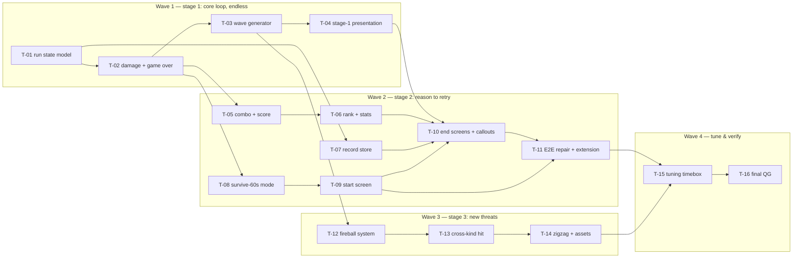

# Task breakdown — survival-loop

<!-- Stage 13 → see SDLC/plugin/skills/break-tasks/SKILL.md -->

## What is being built (for the 1-minute reader)

The polished shooting gallery becomes a survival arcade ([[../PRD.md]]): the player gains HP and a game-over, Endless mode sends generated escalating waves, Survive-60s adds a winnable timer mode, kills build a combo multiplier with far-kill bonuses, every run ends in a rank (D–S) + stats + best-moment screen, and the per-mode best score persists in localStorage — the project's first persisted datum ([[../data-model.md]] §Storage, ADR-0003). Stage 3 adds shooter demons with shootable fireballs and zigzag paths. Delivery follows the PRD's three independently playable stages; here they map to waves 1–3, with wave 4 = tune + verify.

**The architectural spine:** fixed-step simulation deltas are concentrated in the *systems tasks* — T-01 (types), T-02 (damage/game-over), T-03 (waves), T-05 (combo/score), T-06 (stats/rank), T-08 (survive-60s timer), T-12/T-13 (fireball + cross-kind hit). The *presentation tasks* T-04/T-09/T-10 add **zero** simulation mutations (render + DOM + poll/diff wiring only, ADR-0005); storage is isolated in T-07 — the ONLY localStorage touchpoint (ADR-0003). Any other task reaching for the fixed step or for `window.localStorage` is a reviewer red flag. Determinism guardrail everywhere: no wall-clock reads in `src/systems/*` / `src/core/*` (QG-1).

**Decisions closed at this stage:** `run.misses` is **removed** (data-model TBD resolved — accuracy deliberately not tracked, `RunStats` covers the end screen); survive-60s systems work and the start screen are **separate tasks** (T-08 / T-09); the 3-evening tuning budget is an **explicit timeboxed task** (T-15) carrying the PRD §8 kill-criterion checkpoint.

**Slicing:** 16 tasks in 4 waves; each ≤ 1 day, one task = one reviewable PR (≤ 500 LOC). Stories link to PRD AC / SAD §6 flows / data-model / ADRs — they do not duplicate them ("story лінкує, не дублює").

## Dependency graph

Parallel branches: after T-02 lands, the combo branch (T-05→T-06), the record store (T-07, only needs T-01), and the survive-60s branch (T-08→T-09) can run in any order; after T-03, the whole stage-3 branch (T-12→T-13→T-14) is independent of wave 2 and can interleave. Everything converges at T-10 (end screens need rank + record + screens flow) → T-11 (E2E) and at T-15 (tuning needs all content).

## Tasks

| ID | Title | DoR | DoD (summary — full DoD in story) | Deps | Estimate | Owner |
|----|-------|-----|------|------|----------|-------|
| T-01 | Run state model + config scaffold (Round→Run, ADR-0001) | SAD + ADR-0001 Accepted | behavior-neutral: types + factories migrated, 195 unit + 8 E2E stay green; base glossary amended | — | S | Maksym |
| T-02 | Damage system + game-over end-condition (`misses` retires) | T-01 | AC-01/02/02b tests green; step.ts order = the spec | T-01 | S | Maksym |
| T-03 | Parametric wave generator + entity cap (`WAVE_SCHEDULE` retires) | T-02; ADR-0002 Accepted | AC-03 + determinism 60↔144 + long-run cap tests green | T-02 | M | Maksym |
| T-04 | Stage-1 presentation: HP HUD, wave number, hit feedback, game-over screen, retry | T-02, T-03 | AC-04 core green; stage 1 playable end-to-end; existing E2E green | T-02, T-03 | M | Maksym |
| T-05 | Combo multiplier + multiplied score + far-kill bonus | T-02 | AC-05/06 unit green; score stays non-decreasing | T-02 | M | Maksym |
| T-06 | RunStats accumulation + rank pure fn + RANK_TABLE | T-05 | AC-07 unit green; rank boundaries locked | T-05 | S | Maksym |
| T-07 | Fail-soft record store (`storage/records.ts`, ADR-0003) | T-01 | AC-08/09/10 unit green incl. fault injection + v1 missing-key test | T-01 | S | Maksym |
| T-08 | Survive-60s mode end-condition (timer → won) | T-02 | AC-13 + same-step ordering + dual-fatal edge green | T-02 | S | Maksym |
| T-09 | Start screen: mode select, input gating, audio arming (ADR-0005) | T-08 | AC-11/12 green; existing E2E kept green via minimal `?e2e` auto-start | T-08 | M | Maksym |
| T-10 | End screens (rank/stats/record celebration) + combo HUD + callouts | T-04, T-06, T-07, T-09 | flow-3 wiring integration green; both end-screen variants render | T-04, T-06, T-07, T-09 | M | Maksym |
| T-11 | E2E repair + extension (`?e2e` API: record hooks, fast-forward) | T-09, T-10 | full Playwright suite green incl. reload-persistence + fail-soft; stage 2 playable | T-09, T-10 | M | Maksym |
| T-12 | Fireball entity + shooter demon attack (ADR-0004) | T-03 | telegraph→spawn→land tests green; cap holds at 2nd spawn site | T-03 | M | Maksym |
| T-13 | Cross-kind hit resolution + shoot-down rules | T-12 | AC-14/15 green; tie-break locked | T-12 | S | Maksym |
| T-14 | Zigzag paths + stage-3 assets + render | T-13 | zigzag data + license-clean art in manifest; stage-3 E2E smoke green | T-13 | M | Maksym |
| T-15 | Tuning timebox (3 evenings) + kill-criterion checkpoint | T-11, T-14 | values committed; checkpoint decision recorded in T-15-results.md | T-11, T-14 | M (timebox) | Maksym |
| T-16 | Final QG: NFR numbers + 16-AC walkthrough | T-15 | T-16-results.md with PRD §6 numbers; all suites green | T-15 | M | Maksym |

Total: ~13–15 solo evenings-equivalent + the 3-evening tuning timebox. Critical path: **T-01 → T-02 → T-03 → T-04 → T-10 → T-11 → T-15 → T-16** (the survive-60s and combo branches are one hop shorter and fold in before T-10).

## Risks (delta to [[../sad.md]] §11)

- **T-01 must be behavior-neutral.** It is the accepted wide-but-mechanical diff (ADR-0001): every factory and many tests change, zero behavior does. Reviewer checks: no logic edits ride along; the full existing suite passes unmodified in meaning (only field additions).
- **The start screen breaks every auto-starting E2E** (SAD §11 Medium). Mitigation is structural: T-09's own DoD includes a *minimal* `?e2e` auto-start/mode parameter so the existing suite never goes red between PRs; T-11 then does the full API extension (record seed/read hooks, wave fast-forward) + new coverage.
- **Base-invariant amendments are deliberate, never silent** (test-plan, the T-10 game-feel lesson): flat→multiplied score tests are amended in T-05, escape-miss→breakthrough tests (and `misses` removal) in T-02 — each in the task that changes the behavior, called out in its PR description.
- **T-15 carries the feature's High risk** (endless may not be fun): a hard timebox of 3 evenings with the pre-committed fallback — Survive-60s becomes the primary mode. The checkpoint decision is a recorded artifact, not a feeling.
- **Stage 3 (T-12/13/14) is P2 and cheaply cuttable** by design (PRD §2): if it slips, T-15/T-16 run against stages 1–2 and the feature still ships whole per PRD stages 1–2 scope; the cap helper is written in T-03 to sum both entity lists so cutting stage 3 leaves no dead seams.

## Estimation legend

- XS: ≤2h · S: ≤1d · M: 1-2d (borderline — split if it grows) · L: must be split. T-15 is a fixed 3-evening timebox, not an estimate.

## Links

- [[../PRD.md]] · [[../sad.md]] · [[../data-model.md]] · [[../test-plan.md]] · [[../CONTEXT.md]]
- ADRs: [[../adr/0001-extend-round-into-mode-aware-run-state.md]], [[../adr/0002-single-parametric-wave-generator.md]], [[../adr/0003-fail-soft-record-store-behind-versioned-localstorage-key.md]], [[../adr/0004-fireball-as-first-class-shootable-entity.md]], [[../adr/0005-hybrid-canvas-screens-with-dom-controls.md]]
- Storage rules: `.claude/rules/migrations.md` (localStorage contract ACTIVE)
- Style reference: [[../../game-feel/tasks/_epic.md]]
- Runner state: [tracker.md](./tracker.md)
